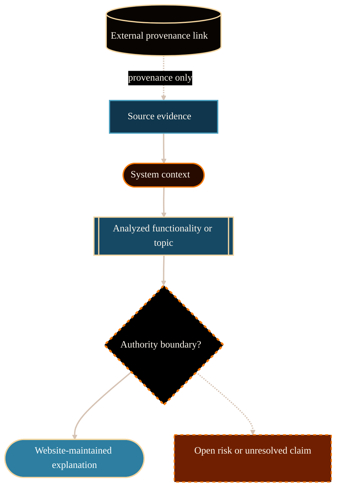

# System Analysis Template

Use this template for
`/Volumes/P-SSD/AngryOwl/The-AEther-Flow-Website/docs/system-analyses/<topic-slug>.md`.
Keep the section order stable. Remove filler, but do not remove a required
section unless the source-analysis quality gate concludes that the section
would be empty padding. Prefer short, evidence-dense paragraphs over broad
summaries.

````md
# <Topic> System Analysis

## Purpose

State what this analysis explains, who it is for, and what decision or
understanding it supports.

## Scope And Authority

Define the bounded scope. State that the analysis is website-maintained
explanatory documentation and not source authority. Identify upstream source
authority for scientific, mathematical, governance, or research-workflow
claims.

## Evidence Reviewed

- `/Volumes/P-SSD/AngryOwl/The-AEther-Flow/<path>` - why it matters.
- `/Volumes/P-SSD/AngryOwl/The-AEther-Flow-Website/<path>` - why it matters,
  if website context was used.

## System Context

Explain where the topic fits in the overall AEther Flow / Interflow project:
neighboring systems, upstream/downstream relationships, control surfaces,
reader-facing surfaces, and authority boundaries.

Use inline parenthetical citations for source-dependent claims.

## Functionality Or Topic Analysis

Explain the system, functionality, or topic in detail. Cover:

- what it is,
- what it does,
- why it exists,
- how it fits into the larger project,
- what is established by source evidence,
- what remains hypothesis, proposal, draft/control, blocked, or unknown.

Preserve exact claim-status language when relevant, such as `proposal-only`,
`draft/control`, `source-extension`, `fail-closed`, `frozen negative`,
`no MetricData(E)`, `no g_eff`, and `no downstream GR promotion`.

## Mermaid Diagram

State the diagram's visual grammar before the Mermaid block when the meanings
are not self-evident. Explain what shapes, borders, arrow styles, edge labels,
groups, and color classes mean for this analysis. Adapt the starter diagram
below instead of preserving it mechanically.



## Interfaces, Inputs, And Outputs

Describe concrete interfaces, input materials, output artifacts, scripts,
registries, validators, route surfaces, or handoff records. Include paths when
that improves maintainability.

## Risks, Failure Modes, And Claim Boundaries

List risks that a maintainer, analyst, or reader could misunderstand. Separate:

- implementation or workflow risks,
- source-authority risks,
- scientific/mathematical claim risks,
- unresolved evidence gaps.

## Open Questions

- Question or unknown that remains after source review.

If none remain, state: "No blocking open questions were identified from the
reviewed evidence."

## Logical Next Step

State the smallest useful next action. Prefer a verifiable repository action,
review step, validator, or bounded follow-up analysis.

## Source-Analysis Quality Gate

Classify the artifact as `pass`, `repair`, or `block`. State only the concise
reasoning needed for maintainers to understand source evidence, authority
limits, major repairs, or blockers.

## References

The AEther Flow. (n.d.). File or document title/path. Local file:
`/Volumes/P-SSD/AngryOwl/The-AEther-Flow/path/to/file`.

The AEther Flow Website. (n.d.). File or document title/path. Local file:
`/Volumes/P-SSD/AngryOwl/The-AEther-Flow-Website/path/to/file`.
````
