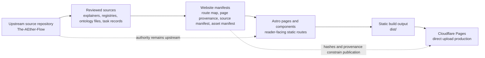
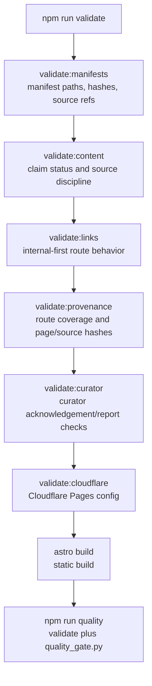
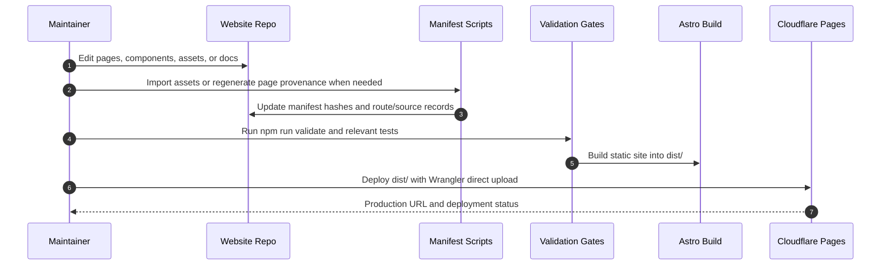

# Website Feature And Functionality Architecture

Date: 2026-06-26

## Analysis

This document describes the current maintainer-facing architecture of The
AEther Flow Website. It is repository documentation, not a public route. Its
purpose is to make the website feature surface, route families, manifests,
validation gates, source-authority boundary, deployment model, and maintainer
workflow easy to inspect before changing the site.

The current site is an Astro static website. It explains and publishes
reader-facing material for the upstream research repository while preserving a
strict authority boundary: scientific, mathematical, governance, and
research-workflow claims remain authoritative only in the upstream source
repository and its governed records.

## Purpose And Source-Authority Boundary

The website is the public reading and publication layer for the upstream
research project. It can explain, organize, promote, and link reviewed material,
but it must not silently strengthen upstream claims or create new scientific
authority.



Operational conclusions:

- The upstream source repository remains authoritative for research claims,
  source files, registries, validators, and governed task records.
- Website pages are explanatory or presentational unless an upstream source
  record explicitly grants authority to the served asset.
- GitHub/source links are provenance paths. Primary reader journeys should use
  internal website routes when those routes exist.
- Ontology TeX files are treated as source-authoritative assets when registered
  upstream; PDFs are generated human-readable derivatives.

## User-Facing Route Families

The primary site navigation is organized around six route families: Overview,
Physics, AI System, Operations, Source Authority, and Resources. This keeps the
reader journey internal-first while preserving explicit provenance and source
inspection paths.

```mermaid
flowchart TD
  site["Website"]
  overview["Overview<br/>/project/overview/"]
  physics["Physics<br/>/project/physics/"]
  ai["AI System<br/>/project/ai-research-agent-system/"]
  ops["Operations<br/>/project/operations/"]
  authority["Source Authority<br/>/project/source-authority/"]
  resources["Resources<br/>/resources/"]

  site --> overview
  site --> physics
  site --> ai
  site --> ops
  site --> authority
  site --> resources

  physics --> ontology["Ontology<br/>/project/physics/ontology/"]
  physics --> current["Current State<br/>/project/physics/current-state/"]
  physics --> benchmark["Exact-GR Benchmark<br/>/project/physics/exact-gr-benchmark/"]
  physics --> roadmap["GR Derivation Roadmap<br/>/project/physics/gr-derivation-roadmap/"]
  physics --> gates["Claim Gates<br/>/project/physics/claim-gates/"]

  ai --> workflow["Workflow landing"]
  ai --> roles["Roles And Skills"]
  ai --> memory["Memory And Registries"]
  ai --> parent["Parent-Child Synthesis"]

  ops --> lifecycle["Director And AgentJob Lifecycle"]
  ops --> routing["Role Routing"]
  ops --> validators["Validator Operator Workflow"]
  ops --> publication["Publication Process"]
  ops --> improvement["Project-System Improvement"]
  ops --> technical["Technical Requirements"]

  resources --> documents["Ontology Documents"]
  resources --> diagrams["Diagram Gallery"]
```



Current route behavior:

- `/project/overview/` is the public entry point for the dual physics-and-AI
  research framing.
- `/project/physics/` is the physics track landing page. Its child pages orient
  readers to ontology, current state, benchmark boundaries, roadmap status, and
  claim gates.
- `/project/ai-research-agent-system/` is the AI research-agent track landing
  page. Its child pages explain workflow, role/skill structure, memory and
  registries, and parent-child synthesis.
- `/project/operations/` is a curated operational synthesis. Its child pages
  explain Director/AgentJob lifecycle, role routing, validation, publication,
  project-system improvement, and technical requirements.
- `/project/source-authority/` explains how to interpret website pages,
  generated derivatives, manifests, and upstream sources.
- `/resources/` is the resource index. `/resources/documents/` is the ontology
  document library, and `/resources/diagrams/` is a visual orientation gallery.

## Content And Asset Model

The site is static and intentionally narrow in runtime complexity:

- Astro routes live under `src/pages/`.
- Shared layouts live under `src/layouts/`.
- Shared UI and publication components live under `src/components/`.
- Site-level navigation, route metadata, resource cards, and source-notice
  defaults live in `src/lib/siteContent.ts`.
- Manifest loading and filtering live in `src/lib/manifests.ts`.
- Public assets and machine-readable manifests live under `public/`.

The current asset model has two primary publication classes:

- Website-local orientation assets, such as the publication-layer diagram
  fixture.
- Canonical ontology PDF and TeX files imported into
  `public/files/pdf/ontology/` and `public/files/tex/ontology/`.

The ontology document rule is deliberately asymmetric. Registered TeX files
carry source authority according to upstream registry metadata. PDFs are served
for reader access and must be described as generated human-readable
derivatives, not independent authority.

## Manifest And Provenance Model

The public manifest layer is the control surface that keeps static publication
auditable:

- `public/files/manifests/source_manifest.json` records source-index entries,
  upstream source paths, approval status, publication paths, hashes, and notes.
- `public/files/manifests/asset_manifest.json` records public asset paths,
  byte counts, SHA-256 hashes, titles, kinds, and `source_manifest:<id>` links.
- `public/files/manifests/page_route_map.json` records route-to-source mapping,
  adaptation type, authority status, publication status, and boundary type.
- `public/files/manifests/page_provenance.json` records generated page hashes,
  upstream source hashes, source commit metadata, and GitHub provenance URLs.
- `public/files/manifests/*.schema.json` files define public JSON contracts for
  source and page provenance data.

The logical contract is:

1. A page or asset must have an explicit source basis.
2. The source basis must be represented in a manifest.
3. The published file must exist under `public/`.
4. File hashes and byte counts must match.
5. Page provenance must be regenerated after page-source changes.
6. Internal reader journeys must not fall back to GitHub as the primary route
   when an internal route exists.

## Validation And Quality Gates

`package.json` defines the configured validation chain. Maintainers should use
`npm run validate` for the full configured gate and `npm run quality` for the
validation gate plus the artifact-level quality gate.



Relevant command surfaces:

- `npm run validate` runs manifest validation, content-source validation,
  internal-first link validation, page-provenance validation, curator checks,
  Cloudflare configuration validation, and the Astro build.
- `npm run validate:manifests` validates source and asset manifests.
- `npm run validate:content` validates content-source discipline.
- `npm run validate:links` rejects mapped upstream GitHub explainer URLs in
  primary page code, except where explicitly allowed for source authority.
- `npm run validate:provenance` validates route coverage, route-map shape,
  page hashes, upstream source hashes, and local-path leak constraints.
- `npm run validate:curator` checks curator report state.
- `npm run validate:cloudflare` checks Cloudflare Pages configuration files.
- `python3 -m pytest` runs Python tests.
- `python3 scripts/quality_gate.py` checks built artifacts in `dist/`.

The `Makefile` also provides helper targets. When there is a difference between
a helper target and `package.json`, treat `package.json` plus `AGENTS.md` as the
configured website validation surface.

## Deployment Workflow

Production currently uses Cloudflare Pages direct upload through Wrangler. It
is not a Cloudflare dashboard Git-integration project.



Direct-upload deployment should follow the documented build-then-upload path:

```bash
make quality
npx --yes wrangler@latest pages deploy dist \
  --project-name the-aether-flow-website \
  --branch main \
  --commit-hash "$(git rev-parse HEAD)" \
  --commit-message "$(git log -1 --pretty=%s)" \
  --commit-dirty=false
```

After deployment, production should be smoke-tested against:

```bash
python scripts/smoke_test_site.py \
  --base-url https://the-aether-flow-website.pages.dev \
  --timeout 20
```

Cloudflare dashboard Git integration remains optional future work. Replacing
the current direct-upload project would be destructive infrastructure work and
requires explicit authorization.

## Maintainer Workflow

The logical next step before any non-trivial content or route change is:

1. Identify whether the change affects website presentation only or upstream
   source authority.
2. If it changes a scientific, mathematical, governance, or research-workflow
   claim, update and validate the upstream source project first.
3. Change the smallest necessary website route, component, manifest, or asset.
4. Regenerate provenance or asset manifests when page or asset hashes change.
5. Run the relevant focused check, then `npm run validate`.
6. Use `npm run quality` before deployment readiness.
7. Deploy only when explicitly authorized.

## Planned Or Accepted Follow-Up Work

The following items are accepted or planned work, not additional current-state
claims:

- Improve future source refresh tooling so drift is detected and reported
  without silently rewriting public pages.
- Keep extending provenance coverage as new public routes and assets are
  approved.
- Adapt useful maintainer diagrams into public website diagrams later as
  static assets, rather than adding a Mermaid runtime dependency.
- Evaluate Cloudflare Git-based deployment only as a deliberate infrastructure
  decision, separate from ordinary website content changes.
- Continue hardening internal-first navigation so GitHub remains provenance
  rather than the primary reading interface.

## Can It Be Improved?

A useful next improvement would be a small diagram-export workflow that renders
selected Mermaid diagrams to reviewed SVG files under `public/assets/diagrams/`
and records them in the existing source and asset manifests. That approach
would keep the public site static, auditable, and dependency-light while making
the best maintainer diagrams available to readers.

## References

The AEther Flow Website. (2026). `AGENTS.md` [Repository operating rules and
definition of done].

The AEther Flow Website. (2026). `README.md` [Website workspace overview,
local development, deployment, and source-authority boundary].

The AEther Flow Website. (2026). `package.json` [Configured Astro, validation,
and quality scripts].

The AEther Flow Website. (2026). `PRDs/internal-explainer-and-source-assets-prd.md`
[Internal explainer and source-asset release contract].

The AEther Flow Website. (2026). `ImplementationPlans/internal_explainer_and_source_assets_implementation_plan.md`
[Internal explainer and source-assets implementation plan].

The AEther Flow Website. (2026). `public/files/manifests/page_route_map.json`
[Route-to-source mapping contract].

The AEther Flow Website. (2026). `public/files/manifests/page_provenance.json`
[Generated route, page-hash, and upstream-source provenance manifest].

The AEther Flow Website. (2026). `public/files/manifests/source_manifest.json`
[Source-index manifest for public assets].

The AEther Flow Website. (2026). `public/files/manifests/asset_manifest.json`
[Published asset manifest with byte counts, hashes, and source references].

The AEther Flow Website. (2026). `docs/deployment/cloudflare-pages.md`
[Cloudflare Pages direct-upload deployment documentation].
