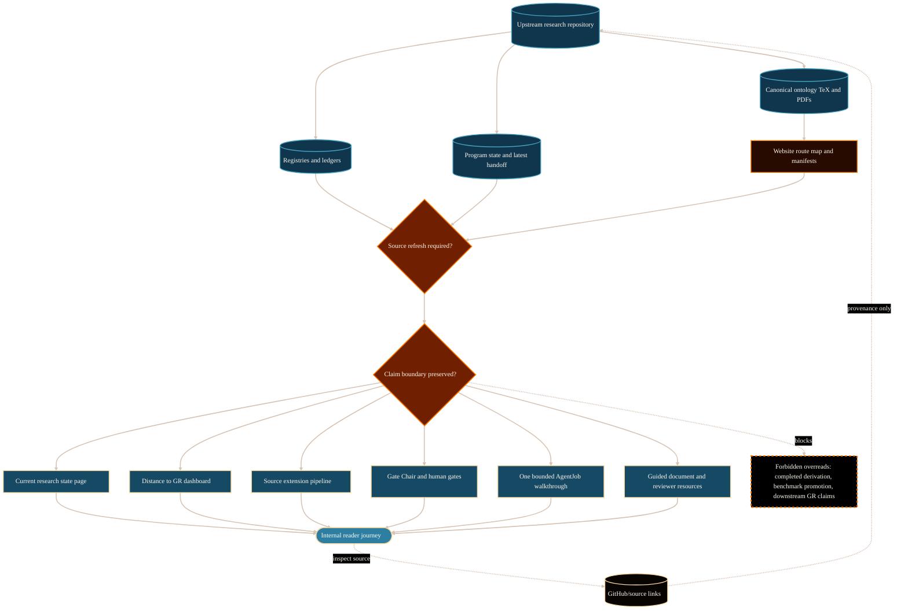

# AEther Flow Website Topic Inventory System Analysis

## Purpose

This analysis identifies AEther Flow systems, functionalities, features, and
research topics that are useful candidates for informative website pages. It is
for maintainers planning how the website can describe, explain, and promote The
AEther Flow project while preserving the upstream source-authority boundary.

The practical decision it supports is page selection: which topics should be
implemented as internal reader-facing routes, which should remain provenance
links, and which require source refresh before public presentation.

## Scope And Authority

Scope is limited to candidate website topics grounded in the upstream source
repository at `/Volumes/P-SSD/AngryOwl/The-AEther-Flow` and the existing website
architecture at `/Volumes/P-SSD/AngryOwl/The-AEther-Flow-Website`.

This document is website-maintained explanatory analysis. It does not create,
strengthen, adopt, or promote any scientific, mathematical, governance, role,
validator, or research-workflow claim. Upstream tracked source files,
registries, research-control records, handoffs, TeX sources, and validators
remain authoritative for project state. Website pages may organize and explain
reviewed material, but must not silently turn `draft/control`,
`proposal-only`, `source-extension`, `fail-closed`, `frozen negative`, or
`human-gated` records into accepted results.

## Evidence Reviewed

- `/Volumes/P-SSD/AngryOwl/The-AEther-Flow/README.md` - front-door definition of
  the dual physics and AI research-agent project, the public exact-GR benchmark,
  open derivation burden, research-agent workflow, and reviewed explainer set.
- `/Volumes/P-SSD/AngryOwl/The-AEther-Flow/CONTEXT.md` - project vocabulary for
  GitHub-facing explainers and subject summaries.
- `/Volumes/P-SSD/AngryOwl/The-AEther-Flow/FOLDER_MAP.md` - folder-level
  authority classification for canonical source, generated derivative, local
  retrieval, tooling, and control lanes.
- `/Volumes/P-SSD/AngryOwl/The-AEther-Flow/research_control/README.md` -
  research-control authority model, one-job rule, theoretical continuation
  gate, ontology-law packet route, Distance-to-GR burden map, memory preflight,
  and documentation-impact rules.
- `/Volumes/P-SSD/AngryOwl/The-AEther-Flow/research_control/program_state.yaml`
  - live active task, latest handoff, current status, claim-boundary summary,
  and next recommended action.
- `/Volumes/P-SSD/AngryOwl/The-AEther-Flow/research_control/handoffs/handoff-0273.md`
  - latest reviewed handoff prose for `RT-20260614-240`.
- `/Volumes/P-SSD/AngryOwl/The-AEther-Flow/research_control/handoffs/handoff-0273.yaml`
  - machine-readable latest handoff fields, blocked claims, selected route, and
  required next packet.
- `/Volumes/P-SSD/AngryOwl/The-AEther-Flow/research_control/current_frontier.md`
  - current-frontier format and older snapshot caution; useful as a page model,
  but not current against `program_state.yaml`.
- `/Volumes/P-SSD/AngryOwl/The-AEther-Flow/research_control/design/gr_derivation_burden_map.md`
  - milestone chain from source ontology to benchmark promotion and explicit
  source-extension and finite-toy categories.
- `/Volumes/P-SSD/AngryOwl/The-AEther-Flow/research_control/design/mathematical_decisiveness_completion_contract.md`
  - completion fields that separate operational validation from physics
  progress.
- `/Volumes/P-SSD/AngryOwl/The-AEther-Flow/registries/README.md` - registry
  functions and generated sidecar boundary.
- `/Volumes/P-SSD/AngryOwl/The-AEther-Flow/registries/DISTANCE_TO_GR_LEDGER.csv`
  - persistent burden rows for source ontology, `Resp_lc`, `M_src`, `g_eff`,
  matter coupling, Einstein equations, benchmark promotion, Gate Chair status,
  finite variation, and finite toy response.
- `/Volumes/P-SSD/AngryOwl/The-AEther-Flow/registries/CLAIM_BOUNDARY_REGISTRY.csv`
  - task-level allowed and forbidden claim boundaries.
- `/Volumes/P-SSD/AngryOwl/The-AEther-Flow/registries/AGENT_ROLE_REGISTRY.csv`
  - active and superseded role families, authority levels, human gates, and
  default validators.
- `/Volumes/P-SSD/AngryOwl/The-AEther-Flow/registries/HTML_EXPLAINER_REGISTRY.csv`
  - reviewed generated explainer inventory and publication validation status.
- `/Volumes/P-SSD/AngryOwl/The-AEther-Flow/registries/TEX_SOURCE_REGISTRY.csv`
  - canonical ontology TeX rows, legacy ontology rows, draft/control research
  TeX artifacts, and their claim/status metadata.
- `/Volumes/P-SSD/AngryOwl/The-AEther-Flow/github-facing/*.md` - reviewed
  public explainer layer used as source-backed orientation for existing website
  routes.
- `/Volumes/P-SSD/AngryOwl/The-AEther-Flow/ontology/` - live ontology document
  lane and asset inventory, interpreted through the TeX registry and website
  source manifest rather than by treating every derivative as independent
  authority.
- `/Volumes/P-SSD/AngryOwl/The-AEther-Flow-Website/AGENTS.md` - website
  operating rules, internal-first journey rule, source-authority boundary, SVG
  policy, and Definition of Done.
- `/Volumes/P-SSD/AngryOwl/The-AEther-Flow-Website/docs/architecture/website-feature-and-functionality.md`
  - current website architecture, route families, manifests, validation gates,
  and deployment model.
- `/Volumes/P-SSD/AngryOwl/The-AEther-Flow-Website/PRDs/internal-explainer-and-source-assets-prd.md`
  - accepted internal explainer route map and ontology asset publication scope.
- `/Volumes/P-SSD/AngryOwl/The-AEther-Flow-Website/public/files/manifests/page_route_map.json`
  - current published route-to-source mapping.
- `/Volumes/P-SSD/AngryOwl/The-AEther-Flow-Website/public/files/manifests/source_manifest.json`
  - ontology asset import records, source paths, hashes, and PDF/TeX authority
  notes.
- `/Volumes/P-SSD/AngryOwl/The-AEther-Flow-Website/src/data/physics_current_state_snapshot.json`
  - checked-in current-state snapshot, which is useful but stale relative to
  the live upstream `program_state.yaml` reviewed here.

## System Context

The website is the public reading and publication layer for the upstream AEther
Flow research project. The upstream project defines two linked missions: a
physics track that keeps ordinary GR as the public observable-scale benchmark
while the first-principles substrate derivation remains open, and an AI
research-agent track that governs theoretical work through roles, tasks,
claim gates, validators, memory, completions, and handoffs (The AEther Flow,
n.d.-a).

The website already implements a strong foundation: overview, physics, AI
system, operations, source-authority, resources, current-state, diagrams, and
ontology document routes are represented in `src/pages/` and
`page_route_map.json` (The AEther Flow Website, n.d.-a; The AEther Flow
Website, n.d.-b). Therefore, the next useful page work should not duplicate
the existing 17 explainer mappings. It should add targeted, source-refreshed
pages that make the living research-control evidence understandable without
collapsing source authority into website prose.

The main tension is promotional clarity versus scientific discipline. The
project is worth presenting with confidence as a rigorous dual physics and AI
research system, but current upstream state still includes protected gates:
the latest `program_state.yaml` and `handoff-0273` say the stress-survived
criteria-aligned coupling-law candidate is ready only for a future narrow Gate
Chair evidence-status/precondition review, with no coupling-law adoption, no
matter-coupling derivation, no `MetricData(E)` adoption, no `g_eff` scope
change, no Einstein equations, no benchmark promotion, and no completed
derivation (The AEther Flow, n.d.-e; The AEther Flow, n.d.-f).

## Functionality Or Topic Analysis

### Selection Model

The most useful candidate pages are those that satisfy four conditions:

1. They help a reader understand why AEther Flow is technically serious.
2. They are grounded in explicit upstream source files or registries.
3. They can be internally linked from the existing website route families.
4. They preserve claim status, especially `draft/control`, `source-extension`,
   `human-gated`, `frozen negative`, `no MetricData(E)`, `no g_eff`, or
   `no g_eff` scope-change language exactly where those terms are source-true
   for the cited state.

### Priority 1: Reader-Value Pages To Implement First

| Candidate webpage | Reader value | Source basis | Implementation note |
| --- | --- | --- | --- |
| Current Research State And Next Gate | Gives returning readers a clear, date-stamped answer to "where is the project now?" | `program_state.yaml`, latest handoff, `DISTANCE_TO_GR_LEDGER.csv`, `CLAIM_BOUNDARY_REGISTRY.csv` | Refresh from live upstream before publication. Existing website snapshot is older than reviewed upstream state. |
| Distance To GR Dashboard | Shows the derivation ladder from source ontology through `g_eff`, matter coupling, Einstein equations, and benchmark promotion. | `gr_derivation_burden_map.md`, `DISTANCE_TO_GR_LEDGER.csv` | Use status badges and blocked-claim copy; avoid progress-bar overclaiming. |
| Source Extension Pipeline | Explains how proposal, audit, stress, selector, and Gate Chair review interact. | `research_control/README.md`, `CLAIM_BOUNDARY_REGISTRY.csv`, `RESEARCH_TASK_REGISTRY.csv` | Strong educational value because it explains how novel work can proceed without claim laundering. |
| Gate Chair And Human-Gated Decisions | Explains protected decisions, exact authorization, and why validators cannot promote claims. | `handoff-0273.yaml`, `AGENT_ROLE_REGISTRY.csv`, `CLAIM_BOUNDARY_REGISTRY.csv` | Useful trust-building page; must preserve "gate readiness is not a Gate Chair verdict." |
| Claim Boundary Explorer | Makes allowed versus forbidden claim forms visible to readers and maintainers. | `CLAIM_BOUNDARY_REGISTRY.csv`, source-authority explainer, claim-gates explainer | Could become an interactive table sourced from registry snapshots. |
| Ontology Document Library With Reading Guide | Helps readers approach canonical TeX/PDF ontology documents in the right order. | `TEX_SOURCE_REGISTRY.csv`, `ontology/tex/*.tex`, `source_manifest.json` | Existing document route can be strengthened with a guided "read this first" path. |
| Research-Agent Workflow Walkthrough | Turns the abstract workflow into one concrete record chain: task, DDR, AgentJob, completion, handoff, registry. | `research_control/README.md`, `AGENT_JOB_REGISTRY.csv`, latest task records | Existing workflow pages can link to a concrete example route. |
| Negative Results And Frozen Routes | Promotes rigor by showing how failed or blocked routes become useful preserved evidence. | `DISTANCE_TO_GR_LEDGER.csv`, `gr_derivation_burden_map.md`, task artifacts in `TEX_SOURCE_REGISTRY.csv` | Must state scoped obstruction is not global theory rejection. |

### Priority 2: Topic Pages That Deepen The Physics Track

| Candidate webpage | Reader value | Source basis | Claim boundary |
| --- | --- | --- | --- |
| AEther / AEther-Flow Ontology Vocabulary | Defines AEther, AEther-flow, observed space, S-time, and expansion language for non-specialists. | `ontology/aether-and-aether-flow.md`, ontology explainer, ontology TeX registry rows | Ontology vocabulary is not a completed derivation. |
| Exact-GR Benchmark Versus Derivation | Separates benchmark compatibility, derivation, and promotion. | README, exact-GR benchmark explainer, `TEX_SOURCE_REGISTRY.csv` | No completed first-principles GR derivation claim. |
| `Resp_lc`, `M_src`, `MetricData(E)`, `g_eff`, And Matter Coupling Ladder | Gives technically curious readers a map of the current derivation objects. | `DISTANCE_TO_GR_LEDGER.csv`, current handoff, relevant task artifacts | Avoid claiming downstream unlocks unless the ledger and Gate Chair evidence support them. |
| Finite Toy Models And Why One Route Froze | Explains why toy models matter and why the explicit-tag-only finite toy route is `frozen negative`. | `gr_derivation_burden_map.md`, `DISTANCE_TO_GR_LEDGER.csv` | A frozen finite toy route is not a global rejection. |
| No-Target-Import Discipline | Explains why hidden target-metric, target-topology, and benchmark-success imports are blocked. | `research_control/design/no_target_import_guard_map.md`, claim-boundary registry | This is methodology and guardrail explanation, not proof of a candidate. |
| Coupling-Law Candidate Status | Explains the current `CouplingLaw_src^{GSC-crit-cand}` route as stress-survived but human-gated. | `handoff-0273.md`, `handoff-0273.yaml`, latest task artifacts | No coupling-law adoption, no matter-coupling derivation or adoption, no Einstein equations. |

### Priority 3: Topic Pages That Promote The AI Research-Agent System

| Candidate webpage | Reader value | Source basis | Implementation note |
| --- | --- | --- | --- |
| One Bounded AgentJob In Practice | Shows the auditability of a single transaction. | `research_control/README.md`, `AGENT_JOB_REGISTRY.csv`, completion YAML records | Use a sanitized example and exact path references. |
| Parent-Child Parallel Synthesis Walkthrough | Explains how multiple analytical perspectives remain inside one outer job. | parent-child explainer, `research_control/README.md`, role records | Existing page can be enhanced with a visual lifecycle diagram. |
| Role Authority Inspector | Helps readers understand why role labels do not grant live permissions. | `AGENT_ROLE_REGISTRY.csv`, roles-and-skills explainer, role-routing explainer | Good candidate for a filterable role table. |
| Memory Preflight And Source-First Retrieval | Shows how memory accelerates lookup while sources remain authority. | `research_control/README.md`, memory-system explainer, registry README | Useful for external AI-agent readers and future maintainers. |
| Validator PASS Does Not Mean Physics Proof | Explains validator result limits with examples. | validator-operator explainer, mathematical decisiveness contract | High value for trust and anti-overclaiming. |
| Project-System Improvement Loop | Explains documentation drift, signals, sidecars, and maintenance packets. | project-system explainer, `research_control/README.md`, signal registries | Existing page can link to concrete signal lifecycle examples. |

### Priority 4: Resource And Promotion Pages

| Candidate webpage | Reader value | Source basis | Risk |
| --- | --- | --- | --- |
| Guided Start Page For Physicists | Gives technically trained readers the fastest path through ontology, benchmark, roadmap, current state, and documents. | existing physics routes, ontology assets, roadmap evidence | Must avoid implying external validation or accepted derivation. |
| Guided Start Page For AI/Agent Researchers | Frames AEther Flow as an applied research-agent governance case study. | workflow, memory, role, validator, publication-process sources | Must distinguish agent behavior from model understanding. |
| Publication And Provenance System | Explains page provenance, source manifests, asset manifests, route maps, and internal-first routing. | website architecture doc, `page_route_map.json`, `source_manifest.json` | Mostly website-maintainer content; should stay operational. |
| Visual Diagram Gallery By Concept | Groups diagrams by physics, AI workflow, operations, and source authority. | existing diagram route, comprehension content, diagram manifests | Diagrams must remain analysis aids, not authority. |
| External Review Packet | Prepares a concise page for reviewers with what is claimed, not claimed, and where to inspect sources. | README, source-authority, current-state, ontology assets | Requires careful source-analysis refuter pass before public use. |

### Recommended Initial Build Order

1. Refresh and strengthen `/project/physics/current-state/` so it reflects
   `RT-20260614-240` / `handoff-0273` or the latest committed upstream source
   state available at implementation time.
2. Add `/project/physics/distance-to-gr/` as a ledger-backed dashboard page.
3. Add `/project/physics/source-extension-pipeline/` as a narrative and visual
   explanation of construct-audit-stress-select-gate progression.
4. Add `/project/physics/gate-chair-and-human-gates/` to explain protected
   verdict authority and exact authorization.
5. Add `/project/ai-research-agent-system/one-bounded-agentjob/` as a concrete
   walkthrough of the governed AI research workflow.
6. Add `/resources/reviewer-packet/` only after the current-state and
   source-authority pages are refreshed, because external review content is
   highest risk for accidental overclaiming.

## Mermaid Diagram

Visual grammar: cylinders are upstream source or registry stores; rectangles
are website page families or implementation candidates; diamonds are authority
or refresh gates; dashed arrows are provenance-only or precondition paths;
solid arrows are primary implementation flow. Cyan source nodes are
authoritative inputs, orange control nodes are process or gates, blue bridge
nodes are candidate page transformations, green target nodes are reader-facing
website outputs, and dashed orange boundary nodes mark forbidden overreads.

## Interfaces, Inputs, And Outputs

Key upstream inputs:

- `research_control/program_state.yaml` supplies live active task, handoff,
  status, boundary summary, and next action.
- `research_control/handoffs/handoff-*.yaml` and `.md` supply exact handoff
  status, blocked claims, selected next route, and required authorization.
- `registries/DISTANCE_TO_GR_LEDGER.csv` supplies derivation burden rows and
  status vocabulary.
- `registries/CLAIM_BOUNDARY_REGISTRY.csv` supplies allowed and forbidden claim
  forms.
- `registries/AGENT_ROLE_REGISTRY.csv` and `registries/AGENT_JOB_REGISTRY.csv`
  supply role and job lifecycle evidence.
- `registries/TEX_SOURCE_REGISTRY.csv` supplies ontology, legacy ontology, and
  draft/control TeX source status.
- `ontology/tex/*.tex` and `ontology/pdfs/*.pdf` supply source and reader
  assets for the document library.
- `github-facing/*.md` supplies reviewed noncanonical explainer surfaces that
  can be adapted into internal pages.

Key website interfaces:

- `src/pages/` defines Astro routes.
- `src/lib/*ComprehensionContent.ts` and `src/lib/internalExplainers.ts`
  organize reader-facing content data.
- `src/data/physics_current_state_snapshot.json` is the checked-in current
  state snapshot for static builds.
- `scripts/refresh_physics_current_state_snapshot.py` refreshes that snapshot
  from upstream sources.
- `public/files/manifests/page_route_map.json` maps public routes to source
  bases.
- `public/files/manifests/source_manifest.json` and
  `asset_manifest.json` track source and asset hashes.
- `scripts/generate_page_provenance.py` regenerates page provenance after page
  changes.
- `npm run validate`, `npm run validate:content`,
  `npm run validate:provenance`, and `npm run build` are relevant validation
  gates.

Expected outputs for future implementation:

- Internal Astro routes, not GitHub-first route cards.
- Source-backed content dossiers or analysis notes before page coding.
- Updated source, asset, route, and page-provenance manifests when public
  routes or assets change.
- Current-state snapshot refresh when a page depends on living upstream state.
- Explicit boundary copy near high-risk physics, workflow, or gate claims.

## Risks, Failure Modes, And Claim Boundaries

Implementation risks:

- A page may duplicate an existing route instead of adding a sharper reader
  job.
- A dynamic-looking dashboard may imply real-time synchronization when the site
  is static and source-pinned.
- A filterable registry view may leak local absolute paths if provenance
  shaping is not handled carefully.
- Current-state pages can become stale unless refresh, provenance, and curator
  checks are part of the implementation packet.

Source-authority risks:

- Website prose may overread generated GitHub-facing Markdown as source
  authority.
- PDF documents may be presented as independent authority instead of generated
  human-readable derivatives of registered TeX.
- GitHub links may become primary reader journeys instead of provenance links.

Scientific and mathematical claim risks:

- The latest reviewed state permits only a future narrow Gate Chair
  evidence-status/precondition review for the coupling-law candidate; it does
  not adopt a coupling law, derive matter coupling, adopt `MetricData(E)`,
  change `g_eff` scope, derive Einstein equations, promote the benchmark, or
  complete the derivation.
- The Distance-to-GR ledger is a control ledger, not a proof surface.
- `source-extension` acceptance, where present, must remain scoped and must not
  be inflated into canonical ontology edit, source-law adoption, or downstream
  GR promotion.
- A `frozen negative` route is a preserved scoped negative result, not global
  theory rejection.

Unresolved evidence gaps:

- The website current-state snapshot reviewed in this task is stale relative to
  live upstream `program_state.yaml`; any current-state implementation should
  refresh it from a clean, committed upstream state before publication.
- `current_frontier.md` is useful as a structure example, but it describes an
  older `RT-20260614-184` state and should not be used as the current source of
  truth without synchronization.
- Some deeper topic pages, such as a public coupling-law candidate explainer,
  should be delayed until the source evidence is frozen to a known commit and
  page provenance is regenerated.

## Open Questions

- Should new pages be implemented as individual Astro routes under
  `/project/physics/` and `/project/ai-research-agent-system/`, or should the
  first iteration be a single "research map" page with expandable sections?
- Should the Distance-to-GR dashboard use a checked-in JSON snapshot derived
  from `DISTANCE_TO_GR_LEDGER.csv`, matching the current-state snapshot model?
- Should high-risk current-state content require a curator report before every
  deployment, even when only source data changes?
- Should a reviewer packet be public now, or kept as a private/maintainer route
  until the current-state pipeline is refreshed and proven stable?

## Logical Next Step

The logical next step is to create a PRD or implementation plan for one bounded
page packet: refresh `/project/physics/current-state/` from the latest clean
upstream commit, then add `/project/physics/distance-to-gr/` as a
ledger-backed dashboard. That packet should include snapshot refresh,
manifest/provenance regeneration, `npm run validate`, and Playwright or browser
QA for the affected routes.

## References

The AEther Flow. (n.d.-a). `README.md`. Local file:
`/Volumes/P-SSD/AngryOwl/The-AEther-Flow/README.md`.

The AEther Flow. (n.d.-b). `CONTEXT.md`. Local file:
`/Volumes/P-SSD/AngryOwl/The-AEther-Flow/CONTEXT.md`.

The AEther Flow. (n.d.-c). `FOLDER_MAP.md`. Local file:
`/Volumes/P-SSD/AngryOwl/The-AEther-Flow/FOLDER_MAP.md`.

The AEther Flow. (n.d.-d). `research_control/README.md`. Local file:
`/Volumes/P-SSD/AngryOwl/The-AEther-Flow/research_control/README.md`.

The AEther Flow. (n.d.-e). `research_control/program_state.yaml`. Local file:
`/Volumes/P-SSD/AngryOwl/The-AEther-Flow/research_control/program_state.yaml`.

The AEther Flow. (n.d.-f). `research_control/handoffs/handoff-0273.md`. Local
file:
`/Volumes/P-SSD/AngryOwl/The-AEther-Flow/research_control/handoffs/handoff-0273.md`.

The AEther Flow. (n.d.-g). `research_control/handoffs/handoff-0273.yaml`.
Local file:
`/Volumes/P-SSD/AngryOwl/The-AEther-Flow/research_control/handoffs/handoff-0273.yaml`.

The AEther Flow. (n.d.-h). `research_control/current_frontier.md`. Local file:
`/Volumes/P-SSD/AngryOwl/The-AEther-Flow/research_control/current_frontier.md`.

The AEther Flow. (n.d.-i). `research_control/design/gr_derivation_burden_map.md`.
Local file:
`/Volumes/P-SSD/AngryOwl/The-AEther-Flow/research_control/design/gr_derivation_burden_map.md`.

The AEther Flow. (n.d.-j).
`research_control/design/mathematical_decisiveness_completion_contract.md`.
Local file:
`/Volumes/P-SSD/AngryOwl/The-AEther-Flow/research_control/design/mathematical_decisiveness_completion_contract.md`.

The AEther Flow. (n.d.-k). `registries/README.md`. Local file:
`/Volumes/P-SSD/AngryOwl/The-AEther-Flow/registries/README.md`.

The AEther Flow. (n.d.-l). `registries/DISTANCE_TO_GR_LEDGER.csv`. Local file:
`/Volumes/P-SSD/AngryOwl/The-AEther-Flow/registries/DISTANCE_TO_GR_LEDGER.csv`.

The AEther Flow. (n.d.-m). `registries/CLAIM_BOUNDARY_REGISTRY.csv`. Local
file:
`/Volumes/P-SSD/AngryOwl/The-AEther-Flow/registries/CLAIM_BOUNDARY_REGISTRY.csv`.

The AEther Flow. (n.d.-n). `registries/AGENT_ROLE_REGISTRY.csv`. Local file:
`/Volumes/P-SSD/AngryOwl/The-AEther-Flow/registries/AGENT_ROLE_REGISTRY.csv`.

The AEther Flow. (n.d.-o). `registries/HTML_EXPLAINER_REGISTRY.csv`. Local
file:
`/Volumes/P-SSD/AngryOwl/The-AEther-Flow/registries/HTML_EXPLAINER_REGISTRY.csv`.

The AEther Flow. (n.d.-p). `registries/TEX_SOURCE_REGISTRY.csv`. Local file:
`/Volumes/P-SSD/AngryOwl/The-AEther-Flow/registries/TEX_SOURCE_REGISTRY.csv`.

The AEther Flow. (n.d.-q). `github-facing` reviewed explainer files. Local
folder: `/Volumes/P-SSD/AngryOwl/The-AEther-Flow/github-facing/`.

The AEther Flow. (n.d.-r). `ontology` source package. Local folder:
`/Volumes/P-SSD/AngryOwl/The-AEther-Flow/ontology/`.

The AEther Flow Website. (n.d.-a). `docs/architecture/website-feature-and-functionality.md`.
Local file:
`/Volumes/P-SSD/AngryOwl/The-AEther-Flow-Website/docs/architecture/website-feature-and-functionality.md`.

The AEther Flow Website. (n.d.-b). `AGENTS.md`. Local file:
`/Volumes/P-SSD/AngryOwl/The-AEther-Flow-Website/AGENTS.md`.

The AEther Flow Website. (n.d.-c). `public/files/manifests/page_route_map.json`.
Local file:
`/Volumes/P-SSD/AngryOwl/The-AEther-Flow-Website/public/files/manifests/page_route_map.json`.

The AEther Flow Website. (n.d.-d). `PRDs/internal-explainer-and-source-assets-prd.md`.
Local file:
`/Volumes/P-SSD/AngryOwl/The-AEther-Flow-Website/PRDs/internal-explainer-and-source-assets-prd.md`.

The AEther Flow Website. (n.d.-e). `public/files/manifests/source_manifest.json`.
Local file:
`/Volumes/P-SSD/AngryOwl/The-AEther-Flow-Website/public/files/manifests/source_manifest.json`.

The AEther Flow Website. (n.d.-f). `src/data/physics_current_state_snapshot.json`.
Local file:
`/Volumes/P-SSD/AngryOwl/The-AEther-Flow-Website/src/data/physics_current_state_snapshot.json`.

The AEther Flow Website. (n.d.-g). `scripts/refresh_physics_current_state_snapshot.py`.
Local file:
`/Volumes/P-SSD/AngryOwl/The-AEther-Flow-Website/scripts/refresh_physics_current_state_snapshot.py`.
