# Current Research State And Next Gate System Analysis

## Purpose

This analysis explains the current physics control state that backs
`/project/physics/current-state/`. It is for website maintainers and readers
who need a source-pinned answer to three questions: what is current, what is
next, and what is not claimed.

The decision it supports is PG-001 refresh readiness: the current-state page
can be refreshed from clean upstream evidence if it remains a checked-in
website snapshot rather than source authority or a Gate Chair verdict.

## Scope And Authority

Scope is limited to the current checked-in website snapshot for physics
control state. This document is website-maintained explanatory analysis, not
source authority. It cannot adopt source law, adopt `MetricData(E)`, change
`g_eff` scope, adopt or derive matter coupling, import stress-energy
semantics, derive Einstein equations, promote the exact-GR benchmark, issue a
Gate Chair verdict, or claim completed derivation.

The authoritative sources remain upstream control records in
`/Volumes/P-SSD/AngryOwl/The-AEther-Flow`. The upstream source repository was
clean at commit `4d249ba24ead51445e496a74b2f6072149bc7609` when the snapshot
was refreshed.

## Evidence Reviewed

- `/Volumes/P-SSD/AngryOwl/The-AEther-Flow/research_control/program_state.yaml`
  - active task, latest handoff, current status, claim-boundary summary, and
  next recommended action.
- `/Volumes/P-SSD/AngryOwl/The-AEther-Flow/research_control/handoffs/handoff-0280.yaml`
  - latest handoff YAML with stress result, blocked claims, Distance-to-GR
  status, and required next packet.
- `/Volumes/P-SSD/AngryOwl/The-AEther-Flow/research_control/handoffs/handoff-0280.md`
  - latest handoff summary in reader-facing control prose.
- `/Volumes/P-SSD/AngryOwl/The-AEther-Flow/registries/DISTANCE_TO_GR_LEDGER.csv`
  - active `matter_coupling` burden row and downstream burden rows.
- `/Volumes/P-SSD/AngryOwl/The-AEther-Flow/registries/CLAIM_BOUNDARY_REGISTRY.csv`
  - forbidden overreads for the current stress result and related task
  boundaries.
- `/Volumes/P-SSD/AngryOwl/The-AEther-Flow-Website/src/data/physics_current_state_snapshot.json`
  - checked-in website snapshot generated from the source evidence.
- `/Volumes/P-SSD/AngryOwl/The-AEther-Flow-Website/scripts/refresh_physics_current_state_snapshot.py`
  - snapshot generation script and clean-source gate.

## System Context

The current-state page is the website's first physics status authority for
readers, but it is not source authority. It reports selected upstream control
state from a checked-in JSON snapshot. The snapshot exists so normal Astro
builds do not silently read a local source repository or auto-refresh public
physics claims.

The live source state now records `RT-20260614-247` and `handoff-0280`. A
Theoretical Continuation Selector classified the audited and stress-survived
`draft/control` recovery-bridge candidate `B_E^{rec}` and
`BridgeCert^{cand}(E,F_E^sharp)` as ready only for a future narrow Gate Chair
evidence-status/precondition review under declared finite/local source-side
scope. That result advances routing evidence, but it does not adopt a coupling
law, derive or adopt matter coupling, import stress-energy semantics, adopt
`MetricData(E)`, change scoped `g_eff`, derive Einstein equations, promote
benchmark status, issue benchmark Gate Chair closure, claim completed
derivation, claim future source-extension impossibility, or reject the global
theory.

## Functionality Or Topic Analysis

The current state has three public facts.

First, the active control state is `RT-20260614-247` with latest handoff
`handoff-0280`. The status is
`matter_coupling_recovery_bridge_selector_requires_narrow_gate_no_adoption`.
The plain-language reading is: the recovery-bridge candidate survived prior
bounded stress, the selector selected only a future narrow Gate Chair
evidence-status/precondition review, and no adoption occurred.

Second, the active Distance-to-GR burden is `matter_coupling`. The ledger row
reports `human-gated` and says the recovery-bridge candidate is gate-ready
only for scoped source-extension evidence-precondition review. The row also
states that no coupling law or matter coupling is adopted.

Third, the next action is one bounded Gate Chair packet only after exact
tracked human authorization. That packet may decide only whether the
draft/control candidate may be accepted as scoped source-extension
recovery-bridge-candidate evidence/precondition. The current page must not
present that future Gate Chair review as already executed.

The blocked-claim list is part of the status. The current handoff preserves:
no canonical ontology edit, no source-law adoption, no `MetricData(E)`
adoption, no `g_eff` scope change, no coupling-law adoption, no matter-coupling
derivation or adoption, no stress-energy semantics, no Einstein equations, no
benchmark promotion, no benchmark Gate Chair closure, no completed derivation,
no future source-extension impossibility, and no global theory rejection.

## Mermaid Diagram

Visual grammar: source records feed a checked-in website snapshot, the snapshot
feeds the public page, and blocked claims remain attached to the snapshot. The
dashed boundary marks forbidden readings such as auto-refresh or claim
promotion.

```mermaid
---
config:
  theme: base
  themeVariables:
    darkMode: true
    background: "#000000"
    primaryColor: "#050403"
    primaryTextColor: "#fff8ef"
    primaryBorderColor: "#d6c3b4"
    lineColor: "#d6c3b4"
    fontFamily: "Inter, ui-sans-serif, system-ui, -apple-system, BlinkMacSystemFont, Segoe UI, sans-serif"
    fontSize: "16px"
    clusterBkg: "#080401"
    clusterBorder: "#d6c3b4"
    edgeLabelBackground: "#000000"
---
flowchart LR
  Upstream["Upstream program state, handoff, ledgers, registries"]
  Snapshot["Checked-in website JSON snapshot"]
  Page["Current-state public page"]
  Blocked["Blocked claims preserved"]
  Review["Curator and maintainer review"]
  Boundary["Forbidden: auto-refresh or claim promotion"]

  Upstream --> Snapshot --> Page
  Snapshot --> Blocked
  Review --> Snapshot
  Page --> Boundary
  Blocked --> Boundary

  classDef default fill:#050403,stroke:#d6c3b4,color:#fff8ef,stroke-width:1.5px;
  classDef source fill:#0f364d,stroke:#48a0c0,color:#fff8ef,stroke-width:2px;
  classDef control fill:#270b01,stroke:#f87800,color:#fff8ef,stroke-width:2px;
  classDef bridge fill:#164964,stroke:#f4d6a1,color:#fff8ef,stroke-width:2px;
  classDef decision fill:#702000,stroke:#f87800,color:#fff8ef,stroke-width:2.25px;
  classDef target fill:#2d7ea0,stroke:#f4d6a1,color:#ffffff,stroke-width:2px;
  classDef success fill:#164964,stroke:#48a0c0,color:#fff8ef,stroke-width:2px;
  classDef risk fill:#702000,stroke:#f87800,color:#fff8ef,stroke-width:2px,stroke-dasharray: 5 5;
  classDef boundary fill:#000000,stroke:#f87800,color:#fff8ef,stroke-width:3px,stroke-dasharray: 5 5;
  classDef external fill:#080401,stroke:#f4d6a1,color:#fff8ef,stroke-width:2px;

  class Boundary boundary;
  class Page,Snapshot control;
  class Review decision;
  class Blocked risk;
  class Upstream source;

  linkStyle default stroke:#d6c3b4,stroke-width:2.25px;
```

## Interfaces, Inputs, And Outputs

Inputs:

- Upstream `program_state.yaml`.
- Latest handoff `handoff-0280.yaml` and `handoff-0280.md`.
- `registries/DISTANCE_TO_GR_LEDGER.csv`.
- `registries/CLAIM_BOUNDARY_REGISTRY.csv`.

Website outputs:

- `src/data/physics_current_state_snapshot.json`.
- Public route `/project/physics/current-state/`.
- Dossier `docs/content-dossiers/physics-current-state/dossier.md`.
- Page provenance and source links pinned to the upstream commit.

## Risks, Failure Modes, And Claim Boundaries

Implementation or workflow risks:

- If the upstream source moves, the checked-in snapshot becomes stale until the
  refresh script is rerun.
- A reader may mistake gate readiness for adoption. The page must keep the
  blocked-claim list visible.
- A reader may mistake the next recommended Gate Chair packet for an already
  executed Gate Chair decision.

Source-authority risks:

- The website snapshot is downstream of upstream control records.
- The snapshot should be refreshed only from clean source state unless a
  separate human decision explicitly accepts dirty source evidence.
- Pinned links are provenance, not the primary reader journey.

Scientific and mathematical claim risks:

- Gate readiness is not coupling-law adoption.
- Gate readiness is not matter-coupling derivation or adoption.
- Validator PASS is not physics proof.
- Gate readiness is not a Gate Chair verdict.
- No public page may infer `MetricData(E)` adoption, `g_eff` scope change,
  Einstein equations, benchmark promotion, completed derivation, future
  source-extension impossibility, or global theory rejection from the current
  handoff.

## Open Questions

- Should PG-002 create a reader-facing Distance-to-GR dashboard from the
  refreshed ledger state now that the active burden is `matter_coupling`?

## Logical Next Step

Run focused validation and browser QA for `/project/physics/current-state/`.
Then continue to PG-002 using the refreshed snapshot and ledger evidence
instead of stale `handoff-0279`, `handoff-0250`, or `handoff-0243` state.

## References

The AEther Flow. (n.d.-a). `research_control/program_state.yaml`. Local file:
`/Volumes/P-SSD/AngryOwl/The-AEther-Flow/research_control/program_state.yaml`.

The AEther Flow. (n.d.-b). `research_control/handoffs/handoff-0280.yaml`.
Local file:
`/Volumes/P-SSD/AngryOwl/The-AEther-Flow/research_control/handoffs/handoff-0280.yaml`.

The AEther Flow. (n.d.-c). `research_control/handoffs/handoff-0280.md`. Local
file:
`/Volumes/P-SSD/AngryOwl/The-AEther-Flow/research_control/handoffs/handoff-0280.md`.

The AEther Flow. (n.d.-d). `registries/DISTANCE_TO_GR_LEDGER.csv`. Local file:
`/Volumes/P-SSD/AngryOwl/The-AEther-Flow/registries/DISTANCE_TO_GR_LEDGER.csv`.

The AEther Flow. (n.d.-e). `registries/CLAIM_BOUNDARY_REGISTRY.csv`. Local
file:
`/Volumes/P-SSD/AngryOwl/The-AEther-Flow/registries/CLAIM_BOUNDARY_REGISTRY.csv`.

The AEther Flow Website. (n.d.-a). `src/data/physics_current_state_snapshot.json`.
Local file:
`/Volumes/P-SSD/AngryOwl/The-AEther-Flow-Website/src/data/physics_current_state_snapshot.json`.

The AEther Flow Website. (n.d.-b). `scripts/refresh_physics_current_state_snapshot.py`.
Local file:
`/Volumes/P-SSD/AngryOwl/The-AEther-Flow-Website/scripts/refresh_physics_current_state_snapshot.py`.
