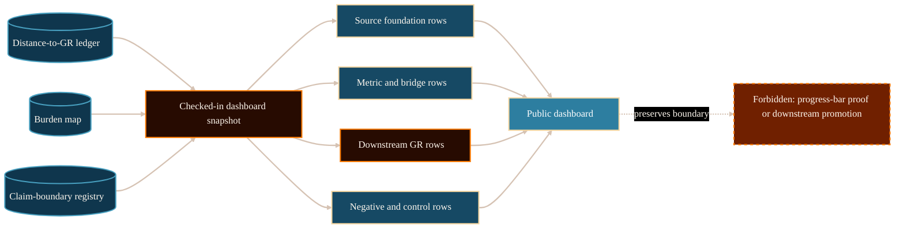

# Distance To GR Dashboard System Analysis

## Purpose

This analysis defines the source basis and page contract for
`/project/physics/distance-to-gr/`. It is for readers and maintainers who need
a ledger-backed map of the GR derivation burden without reading the ledger as
proof, progress percentage, or downstream claim promotion.

The decision it supports is PG-002 implementation readiness: the page can be
created now that the upstream source state is clean, committed, and pinned in a
checked-in dashboard snapshot.

## Scope And Authority

Scope is limited to a website-maintained explanatory dashboard for the
Distance-to-GR burden. This document and the public page cannot adopt source
law, adopt `MetricData(E)`, change `g_eff` scope, adopt a coupling law, derive
or adopt matter coupling, import stress-energy semantics, derive Einstein
equations, promote the exact-GR benchmark, issue a Gate Chair verdict, or
claim completed derivation.

The upstream source repository remains authoritative. It was clean at commit
`4d249ba24ead51445e496a74b2f6072149bc7609` when the dashboard snapshot was
generated.

## Evidence Reviewed

- `/Volumes/P-SSD/AngryOwl/The-AEther-Flow/registries/DISTANCE_TO_GR_LEDGER.csv`
  - primary ledger for the 14 derivation-burden rows.
- `/Volumes/P-SSD/AngryOwl/The-AEther-Flow/research_control/design/gr_derivation_burden_map.md`
  - milestone-chain contract for source, metric, matter-coupling,
  Einstein-equation, and benchmark-promotion burdens.
- `/Volumes/P-SSD/AngryOwl/The-AEther-Flow/research_control/design/mathematical_decisiveness_completion_contract.md`
  - separates operational validation from mathematical or physical completion.
- `/Volumes/P-SSD/AngryOwl/The-AEther-Flow/research_control/design/obstruction_and_freeze_control.md`
  - defines obstruction and freeze records as scoped routing objects.
- `/Volumes/P-SSD/AngryOwl/The-AEther-Flow/registries/CLAIM_BOUNDARY_REGISTRY.csv`
  - forbidden overreads for derivation, validator, gate, and promotion claims.
- `/Volumes/P-SSD/AngryOwl/The-AEther-Flow/research_control/program_state.yaml`
  - current task, handoff, status, and next-action context.
- `/Volumes/P-SSD/AngryOwl/The-AEther-Flow/research_control/handoffs/handoff-0280.yaml`
  - latest handoff with gate-ready, no-adoption, and no-promotion boundaries.
- `/Volumes/P-SSD/AngryOwl/The-AEther-Flow/research_control/handoffs/handoff-0280.md`
  - reader-facing handoff summary and exact authorization boundary.
- `/Volumes/P-SSD/AngryOwl/The-AEther-Flow-Website/src/data/distance_to_gr_snapshot.json`
  - checked-in dashboard snapshot generated from clean source evidence.
- `/Volumes/P-SSD/AngryOwl/The-AEther-Flow-Website/scripts/refresh_distance_to_gr_snapshot.py`
  - snapshot generator with clean-source and absolute-path leak checks.

## System Context

The Distance-to-GR ledger is a control surface for asking what remains between
current source-side artifacts and a completed, benchmarked GR derivation. It
does not measure distance as a scalar percentage. A row can be accepted for a
narrow scoped purpose, blocked, frozen, human-gated, or not started, and those
states do not automatically unlock downstream rows.

The current checked-in snapshot contains 14 rows grouped into four dashboard
regions: source foundation, metric and bridge, downstream GR, and negative or
control rows. The active downstream risk is `matter_coupling`: the latest
selector made the recovery-bridge candidate gate-ready only for a future
narrow Gate Chair evidence-status/precondition review. That is not coupling-law
adoption, matter-coupling derivation or adoption, stress-energy semantics,
Einstein equations, benchmark promotion, or completed derivation.

## Functionality Or Topic Analysis

The dashboard should answer three public questions.

First: what kind of map is this? It is a ledger-backed burden map. It is not a
progress bar, proof certificate, or live synchronization panel. It reads from a
checked-in JSON snapshot generated from a clean upstream commit.

Second: which rows are in view? The page should show source foundation rows
such as ontology and response-localization items, metric/source-bridge rows
such as `M_src` and scoped `g_eff`, downstream rows such as `matter_coupling`
and `einstein_equations`, and negative/control rows such as `frozen negative`
finite-toy evidence.

Third: what is still blocked? The page must make the downstream boundary
plain. Scoped source-extension adoption or acceptance on an earlier row does
not imply `MetricData(E)` adoption, a `g_eff` scope change, matter coupling,
Einstein equations, benchmark promotion, or completed derivation. The current
gate-ready matter-coupling precondition is also not a Gate Chair verdict.

## Mermaid Diagram

Visual grammar: source records feed a checked-in dashboard snapshot, the
snapshot groups ledger rows, and the public dashboard keeps forbidden
overreads outside the claim boundary.

## Interfaces, Inputs, And Outputs

Inputs:

- `registries/DISTANCE_TO_GR_LEDGER.csv`.
- `research_control/design/gr_derivation_burden_map.md`.
- `research_control/design/mathematical_decisiveness_completion_contract.md`.
- `research_control/design/obstruction_and_freeze_control.md`.
- `registries/CLAIM_BOUNDARY_REGISTRY.csv`.
- `research_control/program_state.yaml`.
- Latest handoff `handoff-0280.yaml` and `handoff-0280.md`.

Website outputs:

- `src/data/distance_to_gr_snapshot.json`.
- Public route `/project/physics/distance-to-gr/`.
- Dossier `docs/content-dossiers/physics-distance-to-gr/dossier.md`.
- Static diagram asset
  `/assets/diagrams/comprehension/physics-distance-to-gr-dashboard.png`.
- Route-map, public-comprehension, source-manifest, asset-manifest, and page
  provenance registration.

## Risks, Failure Modes, And Claim Boundaries

Implementation or workflow risks:

- A dashboard may look like a progress bar unless the copy rejects percentage
  completion.
- A checked-in snapshot can drift after upstream source moves.
- Long source artifact paths can overwhelm mobile layout; public copy should
  show relative provenance paths only.

Source-authority risks:

- Ledger rows are evidence records, not proof certificates.
- Validation and status counts are operational controls unless a source
  theorem or protected review supports the corresponding scientific claim.
- The website snapshot is downstream presentation, not live source authority.

Scientific and mathematical claim risks:

- `g_eff` scoped source-extension status must not be treated as matter
  coupling, stress-energy, Einstein equations, benchmark promotion, or
  completed derivation.
- `MetricData(E)` remains a protected boundary unless upstream evidence
  explicitly adopts it.
- `frozen negative` means a scoped route is frozen; it does not establish
  global impossibility.
- Gate readiness is not a Gate Chair verdict.

## Open Questions

- Should later packets split the technical `MetricData(E)` / `g_eff` ladder
  into a separate page, or keep it linked from this dashboard only?

## Logical Next Step

Implement `/project/physics/distance-to-gr/` from the checked-in snapshot,
validate route/provenance/comprehension, and perform desktop and mobile
browser QA.

No-ai-slop gate result: pass for analysis and public-route conversion.

## References

The AEther Flow. (n.d.-a). `registries/DISTANCE_TO_GR_LEDGER.csv`. Local file:
`/Volumes/P-SSD/AngryOwl/The-AEther-Flow/registries/DISTANCE_TO_GR_LEDGER.csv`.

The AEther Flow. (n.d.-b). `research_control/design/gr_derivation_burden_map.md`.
Local file:
`/Volumes/P-SSD/AngryOwl/The-AEther-Flow/research_control/design/gr_derivation_burden_map.md`.

The AEther Flow. (n.d.-c).
`research_control/design/mathematical_decisiveness_completion_contract.md`.
Local file:
`/Volumes/P-SSD/AngryOwl/The-AEther-Flow/research_control/design/mathematical_decisiveness_completion_contract.md`.

The AEther Flow. (n.d.-d).
`research_control/design/obstruction_and_freeze_control.md`. Local file:
`/Volumes/P-SSD/AngryOwl/The-AEther-Flow/research_control/design/obstruction_and_freeze_control.md`.

The AEther Flow. (n.d.-e). `registries/CLAIM_BOUNDARY_REGISTRY.csv`. Local
file:
`/Volumes/P-SSD/AngryOwl/The-AEther-Flow/registries/CLAIM_BOUNDARY_REGISTRY.csv`.

The AEther Flow. (n.d.-f). `research_control/program_state.yaml`. Local file:
`/Volumes/P-SSD/AngryOwl/The-AEther-Flow/research_control/program_state.yaml`.

The AEther Flow. (n.d.-g). `research_control/handoffs/handoff-0280.yaml`.
Local file:
`/Volumes/P-SSD/AngryOwl/The-AEther-Flow/research_control/handoffs/handoff-0280.yaml`.

The AEther Flow Website. (n.d.-a). `src/data/distance_to_gr_snapshot.json`.
Local file:
`/Volumes/P-SSD/AngryOwl/The-AEther-Flow-Website/src/data/distance_to_gr_snapshot.json`.

The AEther Flow Website. (n.d.-b). `scripts/refresh_distance_to_gr_snapshot.py`.
Local file:
`/Volumes/P-SSD/AngryOwl/The-AEther-Flow-Website/scripts/refresh_distance_to_gr_snapshot.py`.
