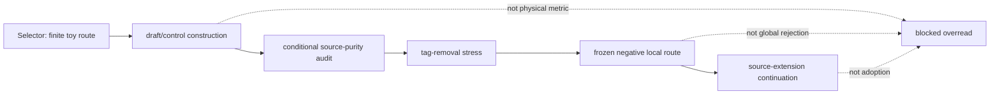

# Finite Toy Models And Frozen Route System Analysis

## Purpose

This analysis supports PG-010: creating
`/project/physics/finite-toy-models/` to explain finite toy models, the
explicit-tag-only finite toy metric-response route, and why that route is
`frozen negative`.

The page may explain the result only as a scoped obstruction. It must not
present the finite toy result as a physical derivation, global theory
rejection, `Resp_lc` adoption, `M_src` adoption, `g_eff` claim, matter-coupling
claim, Einstein-equation claim, benchmark promotion, or completed derivation.

## Scope And Authority

This document is website-maintained explanatory analysis. It is not source
authority and does not change research state. Source authority remains in the
upstream ledgers, task artifacts, handoffs, and claim-boundary registry.

The finite toy route is source-useful because it isolates a small response
problem. It is not source-sufficient for physics adoption. The current
Distance-to-GR row for `finite_toy_metric_response` is `frozen negative`
because the explicit-tag-only route failed tag-removal stress and is frozen
locally.

## Evidence Reviewed

- `registries/DISTANCE_TO_GR_LEDGER.csv`
  - Row `finite_toy_metric_response` records status `frozen negative`.
  - Row notes state that the explicit-tag-only finite toy route failed
    tag-removal stress and is frozen locally.
- `registries/CLAIM_BOUNDARY_REGISTRY.csv`
  - Rows for RT-20260614-052 through RT-20260614-056 define allowed claims,
    forbidden overreads, and gate-required promotions.
- `registries/RESEARCH_TASK_REGISTRY.csv`
  - RT-20260614-052 selected the finite toy route.
  - RT-20260614-053 constructed the finite toy model as `draft/control`
    scaffolding.
  - RT-20260614-054 completed the hidden-import audit as a conditional
    source-purity pass with tag-ontology block.
  - RT-20260614-055 completed Refuter stress as scoped obstruction.
  - RT-20260614-056 selected source-extension candidate work as the next route.
- `registries/ROLE_EXECUTION_REGISTRY.csv`
  - Execution-role records preserve one bounded packet per task and forbid
    claim promotion.
- `research_control/tasks/RT-20260614-053/artifacts/94_RESP_LC_FINITE_TOY_METRIC_RESPONSE_MODEL.tex`
  - Defines the finite toy source set, explicit toy tags, partial response
    relation, and finite analogues as `draft/control` scaffolding.
- `research_control/tasks/RT-20260614-054/artifacts/95_RESP_LC_FINITE_TOY_METRIC_RESPONSE_MODEL_SMUGGLING_AUDIT.tex`
  - Records conditional source-purity only under explicit toy-source tag
    reading and preserves the tag-ontology block.
- `research_control/tasks/RT-20260614-055/artifacts/96_RESP_LC_FINITE_TOY_METRIC_RESPONSE_MODEL_REFUTER_STRESS_TEST.tex`
  - Supplies the tag-removal collapse obstruction, equivariant totalization
    obstruction, and local route freeze.
- `research_control/tasks/RT-20260614-055/jobs/completions/AJC-AJ-RT-20260614-055-001.yaml`
  - Completion record names the scoped obstruction and preserves blocked
    downstream claims.
- `research_control/handoffs/handoff-0097.yaml`
  - Handoff records the finite toy route freeze and next selector action.
- `research_control/tasks/RT-20260614-056/artifacts/97_RESP_LC_THEORETICAL_CONTINUATION_SELECTOR_SOURCE_EXTENSION_DECISION.yaml`
  - Selects source-extension candidate work after the finite toy freeze.

## System Context

Finite toy models serve a control function. They can test whether a proposed
source-to-response mechanism works in a deliberately small setting before any
stronger source-law, metric, matter, equation, or benchmark claim is attempted.

The route failed because the constructed response relation depended on
explicit toy tags. The smuggling audit allowed those tags only as explicit
`draft/control` toy source data. The Refuter stress then removed the tags. Once
tag-removal maps the tagged object to the untagged object `X_empty`, the
response relation is undefined. The candidate therefore cannot be promoted into
an untagged `Resp_lc` witness.

## Functionality Or Topic Analysis

### What toy models can test

- Whether a proposed response rule has a finite source-side analogue.
- Whether explicit assumptions are visible rather than hidden target imports.
- Whether a construction survives finite invariance and variation checks.
- Whether a candidate is robust to relabeling, tag erasure, quotienting, or
  nonuniqueness.

### What toy models cannot prove here

- They cannot by themselves adopt canonical ontology.
- They cannot turn toy tags into source primitives.
- They cannot derive physical `g_eff`, matter coupling, Einstein equations, or
  benchmark promotion.
- They cannot authorize completed GR derivation.

### Why this route froze

The finite toy construction used explicit source-side toy tags. That made the
partial response relation work in the tagged toy setting. The Refuter stress
then asked whether the response survives when the tags are erased. It did not.
The route therefore failed the finite-variation robustness burden and froze
under `NDCL-RESP-LC-SELECTOR-UNDERDETERMINATION`.

The precise conclusion is local: explicit-tag-only finite toy response is not
enough. The conclusion is not global: it is not a global theory rejection, not
future source-extension impossibility, and not a verdict against every possible
finite toy design.

## Mermaid Diagram

## Interfaces, Inputs, Outputs

| Interface | Input | Output | Boundary |
| --- | --- | --- | --- |
| Distance-to-GR ledger | `finite_toy_metric_response` row | `frozen negative` status | Ledger row is status evidence, not proof. |
| Claim-boundary registry | RT-20260614-052 through RT-20260614-056 rows | Allowed and forbidden wording | Registry does not promote claims. |
| Construction artifact | Explicit toy tags and finite source set | Partial response relation | `draft/control`, not ontology adoption. |
| Smuggling audit | Tagged toy construction | Conditional source-purity pass | Tags remain a tag-ontology block. |
| Refuter stress | Tag-removal and symmetry tests | Scoped obstruction and local freeze | Not global theory rejection. |
| Selector artifact | Frozen route evidence | Source-extension candidate route | Not source-extension adoption. |

## Risks, Failure Modes, Claim Boundaries

Primary risk: public readers may hear "toy model" and infer either proof or
failure of the whole theory. Both readings are too strong.

Allowed summary:

- The explicit-tag-only finite toy route is a `frozen negative` result.
- The freeze is local to the tested route.
- The result is useful because it identifies a source-side underdetermination
  failure under tag-removal stress.
- Source-extension and human-gated ontology routes remain conceptually open
  where upstream records allow them.

Forbidden implications:

- finite toy model as metric derivation.
- toy tags adopted as canonical ontology.
- future source-extension impossibility.
- global theory rejection.
- `Resp_lc` adoption from the toy construction.
- `M_src` adoption from the toy construction.
- `g_eff` claim from the toy construction.
- matter coupling, Einstein equations, benchmark promotion, or completed
  derivation from the toy construction.

Hard public phrases to preserve:

- `frozen negative`
- `draft/control`
- `source-extension`
- `no MetricData(E)`
- `no g_eff`
- `no downstream GR promotion`

## Open Questions

- Whether a future finite toy model v2 can use intrinsic source-side invariants
  instead of explicit tags.
- Whether any future source-extension candidate can pass hidden-import audit
  and Refuter stress under current or human-gated source authority.
- Whether the route should eventually be paired with a separate negative-results
  index after PG-012.

## Logical Next Step

The logical next step is a public page that:

1. Begins with a non-specialist explanation of why finite toy models are useful.
2. Shows the finite route sequence from selector to construction, audit, stress,
   freeze, and source-extension continuation.
3. Separates safe and unsafe summaries.
4. Links internally to Distance-to-GR, metric response ladder, source-extension
   pipeline, Gate Chair, and claim-boundary explorer.

## References

The AEther Flow. (2026a). *Distance-to-GR ledger*
[`registries/DISTANCE_TO_GR_LEDGER.csv`].

The AEther Flow. (2026b). *Claim boundary registry*
[`registries/CLAIM_BOUNDARY_REGISTRY.csv`].

The AEther Flow. (2026c). *Research task registry*
[`registries/RESEARCH_TASK_REGISTRY.csv`].

The AEther Flow. (2026d). *Role execution registry*
[`registries/ROLE_EXECUTION_REGISTRY.csv`].

The AEther Flow. (2026e). *Resp_lc finite toy metric-response model*
[`research_control/tasks/RT-20260614-053/artifacts/94_RESP_LC_FINITE_TOY_METRIC_RESPONSE_MODEL.tex`].

The AEther Flow. (2026f). *Resp_lc finite toy metric-response model smuggling audit*
[`research_control/tasks/RT-20260614-054/artifacts/95_RESP_LC_FINITE_TOY_METRIC_RESPONSE_MODEL_SMUGGLING_AUDIT.tex`].

The AEther Flow. (2026g). *Resp_lc finite toy metric-response model Refuter stress test*
[`research_control/tasks/RT-20260614-055/artifacts/96_RESP_LC_FINITE_TOY_METRIC_RESPONSE_MODEL_REFUTER_STRESS_TEST.tex`].

The AEther Flow. (2026h). *Handoff 0097 structured record*
[`research_control/handoffs/handoff-0097.yaml`].

The AEther Flow. (2026i). *Resp_lc theoretical continuation selector source-extension decision*
[`research_control/tasks/RT-20260614-056/artifacts/97_RESP_LC_THEORETICAL_CONTINUATION_SELECTOR_SOURCE_EXTENSION_DECISION.yaml`].
