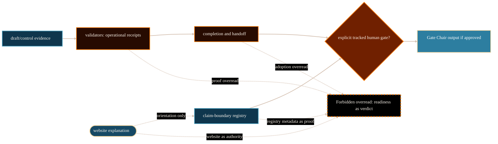

# Gate Chair And Human-Gated Decisions System Analysis

## Purpose

This analysis explains how AEther Flow separates protected human-gated
scientific decisions from ordinary routing, validation, documentation, and
workflow progress. It is for website maintainers and readers who need to
understand why Gate Chair authority exists, what it can decide when explicitly
approved, and why readiness signals are not verdicts.

The decision it supports is PG-004 implementation readiness: a public
`/project/physics/gate-chair-and-human-gates/` page can be created if it
explains decision authority without issuing a Gate Chair verdict or promoting
any physics claim.

## Scope And Authority

Scope is limited to the role-authority and human-gate model. This document is
website-maintained explanatory analysis, not source authority. It cannot
execute a Gate Chair packet, approve source-extension evidence, adopt source
laws, modify ontology, promote a benchmark, reverse `no MetricData(E)`, reverse
`no g_eff`, authorize matter coupling, derive Einstein equations, or close a
derivation.

The authoritative sources remain upstream control documents, registries, role
contracts, task records, handoffs, and explicit tracked human-gated decisions
in `/Volumes/P-SSD/AngryOwl/The-AEther-Flow`. The upstream source repository
was inspected at commit `4d249ba24ead51445e496a74b2f6072149bc7609`; the
working tree was clean except that the branch is ahead of its remote. That
commit pins the source basis for this page.

## Evidence Reviewed

- `/Volumes/P-SSD/AngryOwl/The-AEther-Flow/research_control/program_state.yaml`
  - current tracked status, latest handoff id, and current blocked-claim
  summary.
- `/Volumes/P-SSD/AngryOwl/The-AEther-Flow/research_control/handoffs/handoff-0280.yaml`
  - latest handoff with explicit no-adoption, no-promotion, and next-packet
  language.
- `/Volumes/P-SSD/AngryOwl/The-AEther-Flow/research_control/handoffs/handoff-0280.md`
  - public-readable latest handoff summary and claim boundary.
- `/Volumes/P-SSD/AngryOwl/The-AEther-Flow/registries/AGENT_ROLE_REGISTRY.csv`
  - `gate-chair@0.1.0` authority fields, human-gate state, autonomous-execution
  prohibition, and default validators.
- `/Volumes/P-SSD/AngryOwl/The-AEther-Flow/.agents/roles/physics/gate-chair.v0.1.0.md`
  - Gate Chair mission and boundary: defined but paused; explicit tracked
  approval required for execution and promotion or closure.
- `/Volumes/P-SSD/AngryOwl/The-AEther-Flow/registries/CLAIM_BOUNDARY_REGISTRY.csv`
  - task boundaries showing forbidden promotion forms, including validator as
  proof, role as proof, handoff as proof, and gate readiness as verdict.
- `/Volumes/P-SSD/AngryOwl/The-AEther-Flow/github-facing/claim-gates-explainer.md`
  - generated noncanonical reader explanation of human gates and validator
  limits.
- `/Volumes/P-SSD/AngryOwl/The-AEther-Flow/github-facing/roles-and-skills-explainer.md`
  - generated noncanonical reader explanation of role-status overreads and
  Gate Chair human-gated status.
- `/Volumes/P-SSD/AngryOwl/The-AEther-Flow/github-facing/role-routing-explainer.md`
  - generated noncanonical reader explanation of role templates,
  execution-role records, AgentJob allowlists, and protected authority.
- `/Volumes/P-SSD/AngryOwl/The-AEther-Flow-Website/ImplementationPlans/sitewide_page_revamp_task_packets.md`
  - PG-004 route requirements and constraints.

## System Context

Gate Chair is the project role family reserved for protected scientific
promotion, closure, or suspension decisions after sufficient evidence exists.
It sits downstream of draft/control work, audits, refuter stress, selector
routing, validators, and completions. Those earlier surfaces can prepare or
document a decision context, but they cannot replace the protected decision
itself (The AEther Flow, n.d.-a; The AEther Flow, n.d.-b).

The authority stack matters because AEther Flow uses autonomous research-agent
packets for useful bounded work while preserving human accountability for
high-risk scientific promotion. Role names are templates, execution-role
records and AgentJobs bind one transaction, validators enforce operational
shape, and claim boundaries define forbidden overreads. Gate Chair authority is
therefore not inferred from "this role exists" or "this validator passed"; it
requires explicit tracked approval for the gate transaction (The AEther Flow,
n.d.-c; The AEther Flow, n.d.-d).

The current latest handoff, `handoff-0280`, illustrates the discipline. It
records a completed Theoretical Continuation Selector packet that routed the
draft/control recovery-bridge candidate to one future narrow Gate Chair
evidence-status/precondition review, while preserving no canonical ontology
edit, no source-law adoption, no `MetricData(E)` adoption, no `g_eff` scope
change, no coupling-law adoption, no matter-coupling derivation or adoption,
no stress-energy semantics, no Einstein equations, no benchmark promotion, and
no completed derivation (The AEther Flow, n.d.-e; The AEther Flow, n.d.-f).
That is workflow evidence, not a Gate Chair verdict.

## Functionality Or Topic Analysis

The human-gated model can be read as a conservative decision protocol.

1. Draft/control roles produce or test bounded scientific material. Examples
   include formalization, candidate construction, smuggling audit, refuter
   stress, and selector routing.
2. Validators check deterministic repository and task-record conditions. They
   can confirm that an AgentJob preserved required structure, output paths,
   receipts, and claim boundaries.
3. Completions and handoffs record what happened and what should happen next.
   They can say a candidate is pending stress or that a next packet is
   required.
4. A human gate is required for protected decisions such as ontology adoption,
   source-extension adoption, benchmark promotion, protected role expansion,
   or a Gate Chair verdict.
5. Gate Chair execution itself is defined but paused unless explicit tracked
   approval exists. The role contract says the Gate Chair may promote claims
   only under protected gate status and may not execute autonomously.

The central distinction is readiness versus verdict. A selector can route a
packet toward a future gate. A task can satisfy an operational checklist. A
claim-boundary row can identify what would be forbidden without approval. A
handoff can say the next step requires a protected decision. None of those
objects issues the protected decision.

The public page must therefore use exact narrow language:

- Gate readiness is not a Gate Chair verdict.
- Validator PASS is operational receipt evidence, not physics proof.
- Role registration is not current execution authority.
- Handoff status is not adoption.
- Human authorization is not mathematical evidence.
- A website page is not source authority and cannot promote claims.

For the current physics lane, the latest inspected state remains bounded:
`draft/control` recovery-bridge material is routed only to a future narrow
Gate Chair evidence-status/precondition review, while no source-law adoption,
no `MetricData(E)` adoption, no `g_eff` scope change, no matter-coupling
derivation or adoption, no Einstein equations, no benchmark promotion, and no
downstream GR promotion are authorized.

## Mermaid Diagram

Visual grammar: rounded rectangles are evidence or orientation surfaces,
rectangles are operational records, the diamond is the protected human-gate
decision point, and the dashed boundary node is forbidden claim laundering.
Solid arrows show lawful preparation. Dashed arrows show overreads that must
fail closed.

## Interfaces, Inputs, And Outputs

Inputs:

- `research_control/program_state.yaml` for active task, latest handoff, and
  current blocked claims.
- `research_control/handoffs/handoff-0280.yaml` and `.md` for current
  handoff summary and next action.
- `registries/AGENT_ROLE_REGISTRY.csv` and
  `.agents/roles/physics/gate-chair.v0.1.0.md` for Gate Chair authority
  fields and role contract.
- `registries/CLAIM_BOUNDARY_REGISTRY.csv` for allowed and forbidden claim
  forms.
- Generated noncanonical public explainers for reader-safe vocabulary.

Expected website outputs:

- Public route `/project/physics/gate-chair-and-human-gates/`.
- Dossier `docs/content-dossiers/physics-gate-chair-and-human-gates/dossier.md`.
- Static public diagram asset, not runtime Mermaid.
- Internal links from the physics track and adjacent claim-control pages.
- Route-map, public-comprehension, source-manifest, asset-manifest, and page
  provenance registration.

## Risks, Failure Modes, And Claim Boundaries

Implementation or workflow risks:

- The page could accidentally read as a current Gate Chair decision. It must
  state that it is only an explanation.
- A current handoff example could be misread as adoption. It must remain a
  bounded example of preserved blocked claims.
- Direct source links could overwhelm the reader path. Internal routes should
  carry the main journey, with source links as provenance.

Source-authority risks:

- Generated explainers are useful orientation, not source authority.
- A role registry row is not an execution allowlist for a current transaction.
- A claim-boundary row can show forbidden overreads but cannot prove the
  underlying physics.
- Validator PASS is operational receipt evidence only.

Scientific and mathematical claim risks:

- Gate readiness is not a Gate Chair verdict.
- Gate Chair registration is not autonomous execution authority.
- Human authorization is not mathematical evidence.
- A protected decision can accept scoped evidence without adopting a source law
  or promoting downstream GR claims.
- The page must preserve no source-law adoption, `no MetricData(E)`, `no g_eff`,
  no matter-coupling derivation or adoption, no Einstein equations, no
  benchmark promotion, and `no downstream GR promotion` unless upstream source
  evidence explicitly changes those boundaries.

Unresolved evidence gaps:

- This page does not inspect every historical Gate Chair packet. It uses the
  current latest handoff, role registry, role contract, and claim-boundary
  patterns needed for the public PG-004 route.

## Open Questions

- Should PG-005 add a static claim-boundary explorer that can link from this
  page to concrete allowed and forbidden wording examples?
- Should later current-state refreshes continue to repin this page whenever
  the latest handoff advances, or should they stay scoped to the
  current-state page unless the Gate Chair example materially changes?

## Logical Next Step

Create the public route, dossier, static diagram, manifest registrations, and
browser QA evidence for `/project/physics/gate-chair-and-human-gates/`. Treat
the review status as `technical validation passed` only if validation succeeds
and the page does not turn role registration, validator PASS, handoff state, or
gate readiness into a protected verdict.

## References

The AEther Flow. (n.d.-a). `research_control/README.md`. Local file:
`/Volumes/P-SSD/AngryOwl/The-AEther-Flow/research_control/README.md`.

The AEther Flow. (n.d.-b). `github-facing/claim-gates-explainer.md`. Local file:
`/Volumes/P-SSD/AngryOwl/The-AEther-Flow/github-facing/claim-gates-explainer.md`.

The AEther Flow. (n.d.-c). `registries/AGENT_ROLE_REGISTRY.csv`. Local file:
`/Volumes/P-SSD/AngryOwl/The-AEther-Flow/registries/AGENT_ROLE_REGISTRY.csv`.

The AEther Flow. (n.d.-d). `.agents/roles/physics/gate-chair.v0.1.0.md`.
Local file:
`/Volumes/P-SSD/AngryOwl/The-AEther-Flow/.agents/roles/physics/gate-chair.v0.1.0.md`.

The AEther Flow. (n.d.-e). `research_control/program_state.yaml`. Local file:
`/Volumes/P-SSD/AngryOwl/The-AEther-Flow/research_control/program_state.yaml`.

The AEther Flow. (n.d.-f). `research_control/handoffs/handoff-0280.yaml`.
Local file:
`/Volumes/P-SSD/AngryOwl/The-AEther-Flow/research_control/handoffs/handoff-0280.yaml`.

The AEther Flow. (n.d.-g). `registries/CLAIM_BOUNDARY_REGISTRY.csv`. Local
file:
`/Volumes/P-SSD/AngryOwl/The-AEther-Flow/registries/CLAIM_BOUNDARY_REGISTRY.csv`.

The AEther Flow. (n.d.-h). `github-facing/roles-and-skills-explainer.md`.
Local file:
`/Volumes/P-SSD/AngryOwl/The-AEther-Flow/github-facing/roles-and-skills-explainer.md`.

The AEther Flow. (n.d.-i). `github-facing/role-routing-explainer.md`. Local
file:
`/Volumes/P-SSD/AngryOwl/The-AEther-Flow/github-facing/role-routing-explainer.md`.

The AEther Flow Website. (n.d.). `ImplementationPlans/sitewide_page_revamp_task_packets.md`.
Local file:
`/Volumes/P-SSD/AngryOwl/The-AEther-Flow-Website/ImplementationPlans/sitewide_page_revamp_task_packets.md`.
