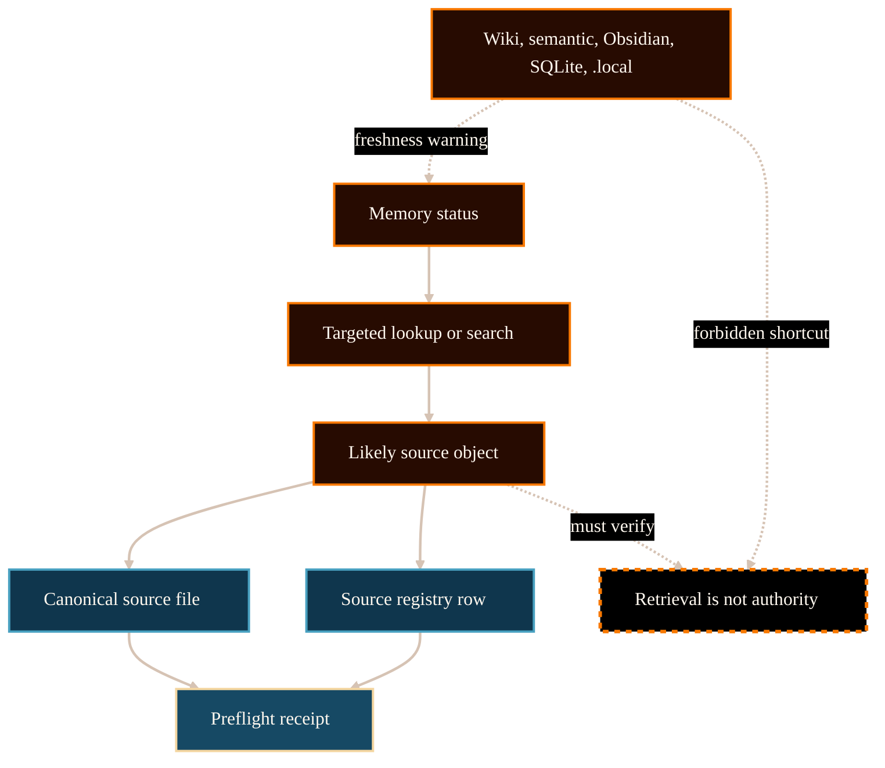

# Memory Preflight And Source-First Retrieval System Analysis

## Purpose

This analysis supports PG-018: rewriting
`/project/ai-research-agent-system/memory-registries/` around memory preflight,
source-first retrieval, and registry authority.

The reader should understand why memory exists, how it helps find evidence,
and why it remains below tracked source files and registry rows.

## Scope And Authority

This document is website-maintained explanatory analysis. It is not source
authority, does not expose private memory contents, does not change memory
commands, does not change registry schemas, and does not authorize routing,
editing, citation, publication, or physics claims.

The authoritative source for memory-preflight behavior remains committed
upstream project-control material, especially `research_control/README.md`,
`.agents/schemas/AGENT_JOB_SCHEMA.md`, source-authority explainers, memory
system explainers, and relevant registries.

## Evidence Reviewed

Committed upstream sources were inspected via `git show HEAD:<path>` to avoid
using dirty working-tree material.

- `/Volumes/P-SSD/AngryOwl/The-AEther-Flow/github-facing/memory-system-explainer.md`
  - Defines memory as source-finding support, not source authority.
- `/Volumes/P-SSD/AngryOwl/The-AEther-Flow/github-facing/source-authority-explainer.md`
  - Defines the authority ladder from registered source files and registries
    down to generated and local retrieval layers.
- `/Volumes/P-SSD/AngryOwl/The-AEther-Flow/research_control/README.md`
  - Defines the required `/continue-research` memory preflight, source
    inspection requirement, receipt fields, and retrieval-layer boundary.
- `/Volumes/P-SSD/AngryOwl/The-AEther-Flow/.agents/schemas/AGENT_JOB_SCHEMA.md`
  - Defines the `memory_preflight` AgentJob schema block, canonical inspection
    requirements, and authority note.
- `/Volumes/P-SSD/AngryOwl/The-AEther-Flow/registries/MARKDOWN_SOURCE_REGISTRY.csv`
  - Representative registry lane for registered Markdown sources.
- `/Volumes/P-SSD/AngryOwl/The-AEther-Flow/registries/TEX_SOURCE_REGISTRY.csv`
  - Representative registry lane for physics and derivational TeX sources.
- `/Volumes/P-SSD/AngryOwl/The-AEther-Flow/registries/WIKI_ARTIFACT_REGISTRY.csv`
  - Representative downstream wiki retrieval registry.
- `/Volumes/P-SSD/AngryOwl/The-AEther-Flow/registries/CONTENT_SEMANTIC_REGISTRY.csv`
  - Representative deterministic semantic extraction registry.
- `/Volumes/P-SSD/AngryOwl/The-AEther-Flow-Website/src/pages/project/ai-research-agent-system/memory-registries/index.astro`
  - Existing website route to rewrite in place.
- `/Volumes/P-SSD/AngryOwl/The-AEther-Flow-Website/docs/content-dossiers/ai-memory-registries/dossier.md`
  - Existing public-comprehension dossier and diagram contract.

## Source-State Note

The upstream working tree is currently dirty because later candidate-era files
exist outside the committed source state. PG-018 therefore uses committed HEAD
records only and does not rely on private or uncommitted memory contents.

## System Context

Memory preflight is a retrieval discipline inside the governed research-control
workflow. It runs before routing or AgentJob creation so the Director and
operator can find relevant prior source objects and registry rows without
treating retrieval hits as authority (The AEther Flow, 2026a, 2026c).

The source-authority ladder remains decisive. Registered TeX carries physics
and derivational claims, registries carry routing and provenance metadata, and
registered Markdown carries project guidance. Wiki notes, semantic extracts,
Obsidian mirrors, SQLite indexes, and `.local` caches are downstream retrieval
surfaces only (The AEther Flow, 2026b).

## Functionality Or Topic Analysis

### What memory preflight does

Memory preflight checks local retrieval freshness, uses targeted lookup or
search to find likely source objects, and records enough receipt evidence for a
future reviewer to reconstruct what was used. In continuation work, the
preflight begins with the governed command described in
`research_control/README.md`, then records the receipt-facing memory status and
targeted queries when the result influences routing, claim language, source
selection, or project-control changes (The AEther Flow, 2026c).

### What source-first retrieval means

The safe sequence is:

1. Check memory status and local retrieval freshness.
2. Use a targeted lookup or search.
3. Inspect the named canonical source file or CSV registry row.
4. Record canonical inspections, source registries, canonical paths, and hashes
   when memory affects controlled work.
5. Treat generated and local layers as retrieval evidence only.

The AgentJob schema encodes this boundary directly: generated wiki, semantic,
Obsidian, relationship, and `.local` IDs are retrieval evidence and must not be
listed as canonical returns when routing or claims depend on them (The AEther
Flow, 2026d).

### What the public page must exclude

The public page should teach the method without exposing private memory
contents, local lookup results, local vault details, private prompt caches, or
uncommitted source-state material. It can name surface classes and receipt
fields. It should not publish object IDs or local cache content unless already
committed and intended for public presentation.

## Mermaid Diagram

Visual grammar: blue source nodes are authoritative inputs; orange process
nodes are retrieval and inspection steps; the blue receipt node is operational
evidence; the dashed boundary node marks the forbidden implication that
retrieval equals authority. Solid arrows show the required inspection order.
Dashed arrows show drift warnings and boundary checks.

## Interfaces, Inputs, And Outputs

| Interface | Input | Output | Boundary |
| --- | --- | --- | --- |
| Memory status | Retrieval-layer state | Freshness summary and warnings | Warning is not authority. |
| Lookup/search | Targeted query | Likely IDs, paths, or source objects | Hit must be source-verified. |
| Source registry | Source-object row | Canonical path and hash context | Row does not replace file inspection. |
| Canonical source file | Tracked source content | Evidence for routing or claim language | Source status still controls scope. |
| AgentJob `memory_preflight` | Status, query, inspection, hash data | Receipt block | Operational receipt, not proof. |
| Local retrieval layers | Mirrors, wiki, semantic, SQLite, `.local` | Search acceleration | Do not cite as authority. |

## Risks, Failure Modes, And Claim Boundaries

Implementation and workflow risks:

- treating memory preflight as a broad scan instead of a targeted lookup;
- recording retrieval IDs without canonical source inspection;
- publishing local memory contents that were never intended as public material;
- treating freshness repair as a source-state change.

Source-authority risks:

- treating a wiki note, semantic extract, Obsidian mirror, SQLite hit, or
  `.local` cache as a citation source;
- treating a source registry row as a substitute for reading the source file;
- using generated derivatives to override registered TeX, Markdown, or control
  records.

Scientific and workflow claim boundaries:

- memory preflight cannot prove physics claims;
- memory status cannot promote generated derivatives;
- receipt evidence cannot bypass AgentJob allowlists or human gates;
- source-first retrieval does not change the current research state.

## Open Questions

No blocking open questions were identified from the reviewed committed
evidence. The public page should avoid concrete local memory contents unless a
future packet explicitly creates a public-safe sample.

## Logical Next Step

Rewrite `/project/ai-research-agent-system/memory-registries/`, update its
dossier and diagram, refresh manifests/provenance, then run desktop/mobile
browser QA.

## References

The AEther Flow. (2026a). *Memory, registries, wiki, and retrieval surfaces*
[`github-facing/memory-system-explainer.md`].

The AEther Flow. (2026b). *Source authority and generated derivatives*
[`github-facing/source-authority-explainer.md`].

The AEther Flow. (2026c). *Research control*
[`research_control/README.md`].

The AEther Flow. (2026d). *AgentJob schema*
[`.agents/schemas/AGENT_JOB_SCHEMA.md`].

The AEther Flow Website. (2026). *Memory and registries route*
[`src/pages/project/ai-research-agent-system/memory-registries/index.astro`].
