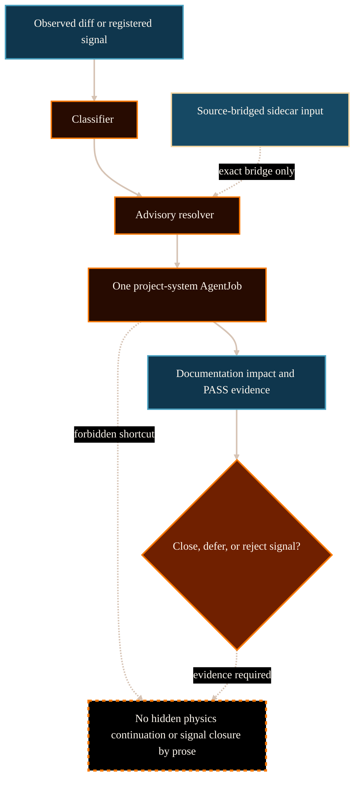

# Project-System Improvement Loop System Analysis

## Purpose

This analysis supports PG-020: rewriting
`/project/operations/project-system-improvement/` as a public and
maintainer-readable explanation of improvement signals, sidecars, and bounded
maintenance packets.

The reader should understand how project-system issues are classified,
routed, executed, receipted, and closed without becoming physics continuation
or scientific claim promotion.

## Scope And Authority

This document is website-maintained explanatory analysis. It is not source
authority, does not create or close signals, does not create sidecars, does not
change routing behavior, does not change validator behavior, does not expand
role authority, and does not authorize physics claim promotion.

The authoritative source for project-system improvement behavior remains
committed upstream project-control material: the project-system improvement
explainer, research-control guide, project-control script guide, signal-type
registry, signal registry, handoff schema, and task-local AgentJob completion
records.

## Evidence Reviewed

Committed upstream sources were inspected via `git show HEAD:<path>` to avoid
using dirty working-tree material.

- `/Volumes/P-SSD/AngryOwl/The-AEther-Flow/github-facing/project-system-improvement-explainer.md`
  - Defines the improvement loop, sidecar flow, resolver boundary, closure
    evidence, and reader scope.
- `/Volumes/P-SSD/AngryOwl/The-AEther-Flow/research_control/README.md`
  - Defines documentation-impact requirements, signal routing, resolver
    limits, and evidence required to resolve, complete, close, or reject
    project-improvement signals.
- `/Volumes/P-SSD/AngryOwl/The-AEther-Flow/scripts/project_control/README.md`
  - Defines classifier, resolver, signal collection, sidecar generation,
    sidecar validation, documentation-impact validation, and sidecar allowlist
    boundaries.
- `/Volumes/P-SSD/AngryOwl/The-AEther-Flow/registries/PROJECT_IMPROVEMENT_SIGNAL_TYPE_REGISTRY.csv`
  - Defines the controlled signal-type vocabulary and default recommended
    skill/role routing.
- `/Volumes/P-SSD/AngryOwl/The-AEther-Flow/registries/PROJECT_IMPROVEMENT_SIGNAL_REGISTRY.csv`
  - Records concrete signal instances, severity, status, evidence, and
    resolution fields.
- `/Volumes/P-SSD/AngryOwl/The-AEther-Flow/.agents/schemas/PROJECT_IMPROVEMENT_HANDOFF_SCHEMA.md`
  - Defines project-improvement sidecar field contract and source-bridge
    metadata.
- `/Volumes/P-SSD/AngryOwl/The-AEther-Flow-Website/src/pages/project/operations/project-system-improvement/index.astro`
  - Existing website route to rewrite in place.
- `/Volumes/P-SSD/AngryOwl/The-AEther-Flow-Website/docs/content-dossiers/operations-project-system-improvement/dossier.md`
  - Existing public-comprehension dossier and diagram contract.

## Source-State Note

The upstream working tree is currently dirty because later candidate-era files
exist outside the committed source state. PG-020 therefore uses committed HEAD
records only and does not rely on uncommitted signal, sidecar, or completion
records.

## System Context

Project-system improvement is the maintenance lane for the research system
itself. It handles documentation drift, generated-artifact drift, control
contract drift, workflow friction, validator gaps, memory retrieval failures,
routing ambiguity, role authority mismatches, claim-boundary confusion, and
human-gate policy gaps (The AEther Flow, 2026a, 2026d).

The lane is deliberately separate from physics continuation. It can repair the
operating machinery around the research, but it cannot promote ontology,
benchmark status, Gate Chair decisions, completed derivation language, or
downstream GR claims (The AEther Flow, 2026a, 2026b).

## Functionality Or Topic Analysis

### What starts the loop

The loop can start from an observed Git diff, a registered open signal, a
repeated workflow problem, or a research completion that emits
`project_improvement_signals`. Memory preflight may locate prior context, but
source files and registry rows must be inspected before action (The AEther
Flow, 2026a).

### What the classifier and resolver do

The classifier describes current diff impact and reason codes. The resolver
compares live state and registered signals to recommend a next project-system
boundary. Resolver output is advisory. Hard checkpoint blocking still comes
from validators and concrete authority-boundary violations, not from a future
recommendation alone (The AEther Flow, 2026b, 2026c).

### What sidecars do

Project-improvement sidecars can carry source-bridge evidence from a
qualifying completion into the project-system lane. They are inputs, not normal
research handoffs and not completed repairs. Checkpoint and diff validation
allow only the exact sidecar YAML/Markdown pair referenced by changed,
AgentJob-allowed source YAML through generated `project_improvement_bridge`
metadata; this is not a global directory allowlist (The AEther Flow, 2026a,
2026c).

### What closes a signal

Signal rows that move out of open backlog into `resolved`, `completed`,
`closed`, or `rejected` need explicit resolution evidence. For resolved,
completed, or closed rows, the evidence path must point to a PASS completion
YAML with matching `job_id`. For rejected rows, a Director decision can provide
the rejection evidence. Free-text claims do not close signals (The AEther Flow,
2026b).

## Mermaid Diagram

Visual grammar: orange nodes are routing and execution processes; blue nodes
are tracked evidence inputs or receipts; the dashed orange boundary marks
forbidden overread. Solid arrows show the improvement loop. Dashed arrows show
sidecar input and forbidden physics-continuation shortcuts.

## Interfaces, Inputs, And Outputs

| Interface | Input | Output | Boundary |
| --- | --- | --- | --- |
| Classifier | Current diff or staged paths | Documentation-impact and project-system reason codes | Routing evidence, not correctness proof. |
| Resolver | Live diff, open signals, optional sidecar context | Advisory selected boundary | Not a hard checkpoint gate by itself. |
| Signal registry | Concrete signal rows | Severity, status, evidence, resolution fields | Free text does not create or close signals. |
| Signal-type registry | Signal vocabulary | Default skill and role routing | Type does not determine urgency alone. |
| Sidecar generation | Qualifying completion and source handoff | Paired YAML/Markdown sidecar | Input, not research handoff replacement. |
| Documentation impact | Changed source/generated surfaces | Impact receipt or no-op rationale | Required for state-changing project-system AgentJobs. |
| Completion evidence | Command results and verdict | Signal closure evidence when matching | Required for resolved/completed/closed signals. |

## Risks, Failure Modes, And Claim Boundaries

Implementation and workflow risks:

- treating resolver output as a hard checkpoint gate;
- treating sidecar existence as signal closure;
- treating conditional sidecar checkpoint acceptance as a global sidecar
  directory allowlist;
- changing project-system state without documentation-impact evidence;
- closing multiple signals without a coherent completion summary.

Source-authority risks:

- using memory or generated sidecars without source-bridge inspection;
- using free-text signal mentions instead of registered rows;
- treating website prose as source authority for signal state.

Scientific and workflow claim risks:

- project-system improvement is not physics continuation;
- sidecars do not replace normal research handoffs;
- maintenance packets cannot promote ontology, benchmark status, Gate Chair
  decisions, completed derivation language, or downstream GR claims;
- validator PASS remains operational evidence, not scientific proof.

## Open Questions

No blocking open questions were identified from the reviewed committed
evidence. Public pages should not publish private sidecar or signal contents
unless they are committed and intended for public presentation.

## Logical Next Step

Rewrite `/project/operations/project-system-improvement/`, update its dossier
and diagram, refresh manifests/provenance, then run desktop/mobile browser QA.

## References

The AEther Flow. (2026a). *Project-system improvement loop*
[`github-facing/project-system-improvement-explainer.md`].

The AEther Flow. (2026b). *Research control*
[`research_control/README.md`].

The AEther Flow. (2026c). *Project-control scripts*
[`scripts/project_control/README.md`].

The AEther Flow. (2026d). *Project improvement signal type registry*
[`registries/PROJECT_IMPROVEMENT_SIGNAL_TYPE_REGISTRY.csv`].

The AEther Flow Website. (2026). *Project-system improvement route*
[`src/pages/project/operations/project-system-improvement/index.astro`].
