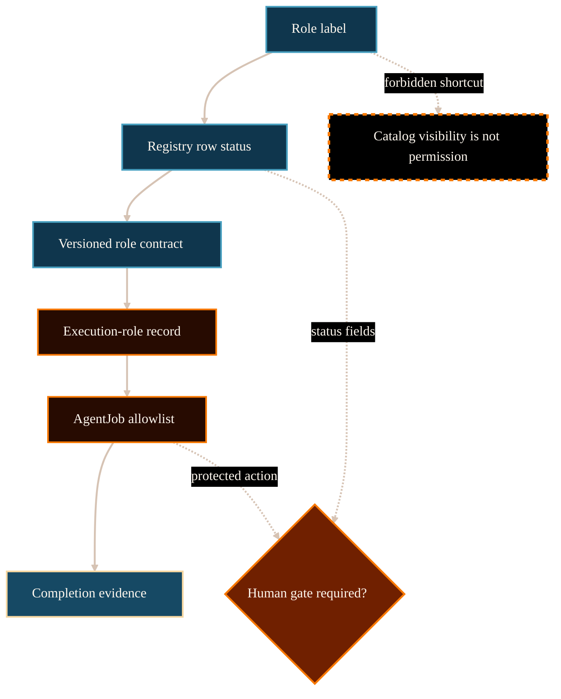

# Role Authority Inspector System Analysis

## Purpose

This analysis supports PG-017: creating
`/project/ai-research-agent-system/role-authority-inspector/` to explain why
role labels do not grant live permissions.

The route should help readers inspect role authority without turning a public
registry display into role activation or write permission.

## Scope And Authority

This document is website-maintained explanatory analysis. It is not source
authority and does not register roles, supersede roles, change role contracts,
change schemas, change routing behavior, change AgentJob allowlists, or
authorize claim promotion.

The authoritative source for role identity and status remains
`registries/AGENT_ROLE_REGISTRY.csv`, plus the role contract, execution-role
record, AgentJob, claim boundary, and completion evidence for a specific
transaction.

## Evidence Reviewed

Committed upstream sources were inspected via `git show HEAD:<path>` to avoid
using dirty working-tree material.

- `/Volumes/P-SSD/AngryOwl/The-AEther-Flow/registries/AGENT_ROLE_REGISTRY.csv`
  - Provides role identity, version, role kind, contract path, authority level,
    status, autonomous execution flag, output flag, source-modification flag,
    claim-promotion flag, human-gate flag, default output format, validators,
    timestamps, and notes.
- `/Volumes/P-SSD/AngryOwl/The-AEther-Flow/github-facing/roles-and-skills-explainer.md`
  - Defines role and skill catalog visibility as navigation, not live
    authority.
- `/Volumes/P-SSD/AngryOwl/The-AEther-Flow/github-facing/role-routing-explainer.md`
  - Defines the inspection stack: registered role contract, execution-role
    record, AgentJob allowlist, claim boundary, and completion evidence.
- `/Volumes/P-SSD/AngryOwl/The-AEther-Flow/.agents/schemas/EXECUTION_ROLE_SCHEMA.md`
  - Defines `registered_role`, `task_overlay`, and
    `one_job_provisional_role` as one-job authority mechanisms.
- `/Volumes/P-SSD/AngryOwl/The-AEther-Flow/.agents/schemas/AGENT_JOB_SCHEMA.md`
  - Defines the executable allowlist, validators, expected outputs, and claim
    boundary that control a transaction.
- `/Volumes/P-SSD/AngryOwl/The-AEther-Flow/research_control/README.md`
  - Defines the authority model and one-job rule.

## Source-State Note

The upstream working tree is currently dirty because later candidate-era files
exist outside the committed source state. PG-017 therefore uses committed HEAD
records only and does not rely on uncommitted `RT-20260614-250` material.

## System Context

Role authority is layered. A role row can say that a role exists and describe
its default authority category. It does not say that the role is currently
allowed to act in a specific transaction (The AEther Flow, 2026a, 2026c).

The safe inspection order is:

1. role registry row;
2. role contract source file;
3. execution-role record;
4. AgentJob allowlist and claim boundary;
5. completion and validator evidence; and
6. human-gate approval when required.

This order prevents three common errors: treating historical rows as active,
treating public catalog visibility as permission, and treating a role template
as a current write allowlist (The AEther Flow, 2026b, 2026c, 2026d).

## Representative Registry Readings

The route can use representative committed rows without presenting the website
as the registry.

| Role row | Status reading | Safe interpretation | Unsafe interpretation |
| --- | --- | --- | --- |
| `director-of-research@0.3.0` | active, routing control, cannot modify sources or promote claims | Can route bounded work under the relevant control process. | Director label grants all write authority. |
| `ontology-formalizer@0.2.0` | active, science draft, cannot promote claims | Can produce bounded draft/control formalization when an AgentJob allows it. | Role name adopts ontology or source law. |
| `gate-chair@0.1.0` | status defined, human-gated, may promote claims only through protected gate | The role exists, but execution/promotion need explicit tracked approval. | Gate Chair row itself authorizes promotion. |
| `project-control-maintainer@0.2.0` | active, project control, may modify project-control sources, cannot promote claims | Can maintain control surfaces inside an AgentJob allowlist. | Project-control role can promote physics. |
| `director-of-research@0.1.0` | superseded historical role | Kept so old execution records remain interpretable. | Superseded row is active by visibility. |

## Functionality Or Topic Analysis

### Public layer

A general reader should learn that role labels are names in a control system,
not live permissions. The page should feel like an inspector: it shows what to
check and what not to infer.

### Specialist layer

A specialist should see the fields that matter:

- `authority_level`;
- `status`;
- `may_execute_autonomously`;
- `may_create_outputs`;
- `may_modify_sources`;
- `may_promote_claims`;
- `requires_human_gate`;
- default validators;
- execution-role kind; and
- current AgentJob allowlist.

### Static table constraint

A static table is acceptable only if it remains readable on mobile and does
not imply live filtering or source authority. A card-based inspector is safer:
it can show representative rows while preserving the source link as
provenance.

## Mermaid Diagram

Visual grammar: source-shaped nodes identify role-facing evidence; process
nodes identify task-local execution controls; the dashed orange boundary marks
the forbidden shortcut from public catalog visibility to permission. Solid
arrows show the primary inspection order. Dashed arrows show conditional or
boundary checks.

## Interfaces, Inputs, Outputs

| Interface | Input | Output | Boundary |
| --- | --- | --- | --- |
| Role registry | Role id, version, status, authority fields | Identity and default status | Not live permission. |
| Role contract | Versioned source file | Mission and boundaries | Not current allowlist. |
| Execution-role record | Task-local binding | `registered_role`, `task_overlay`, or `one_job_provisional_role` | One job only. |
| AgentJob | Reads, writes, outputs, validators, claim boundary | Executable permission envelope | Controls actual transaction. |
| Completion | Outputs and command evidence | Verdict and next recommendation | Not broad authority. |
| Human gate | Explicit tracked approval | Protected action may proceed if authorized | Required for protected promotion. |

## Risks, Failure Modes, Claim Boundaries

Primary risks:

- making a registry display look like a permission console;
- implying active role status grants current write permission;
- implying superseded rows are active because visible;
- implying human-gated role existence equals approval;
- implying `may_promote_claims` can bypass a human gate;
- exposing private local runtime details.

Hard boundaries:

- registry display is not permission;
- role contract is not AgentJob allowlist;
- execution-role records are task-local;
- task overlays are not reusable role versions;
- provisional roles expire unless registered;
- Gate Chair remains human-gated;
- Documentation Curator output is not source authority for claims;
- validator PASS is not physics proof.

## Page Recommendations

The public page should:

- explain the authority stack;
- show representative role rows as static cards, not as live source state;
- distinguish `active`, `superseded`, and `status_defined`;
- distinguish role authority from execution authority;
- link to roles-and-skills, role routing, one bounded AgentJob, and source
  authority;
- keep source links in provenance; and
- include safe and unsafe summaries.

## No-AI-Slop Gate

Status: pass with required edits.

Required edits:

- create route, dossier, and diagram;
- avoid private local details;
- avoid live-console or activation language;
- preserve human-gate and AgentJob allowlist boundaries; and
- run desktop/mobile browser QA.

## Open Questions

No blocking open questions were identified from the reviewed committed
evidence. The only source-state limitation is that the upstream working tree is
dirty, so this route intentionally avoids uncommitted later records.

## Logical Next Step

Create the public route, dossier, static diagram, manifest registrations, and
browser QA for `/project/ai-research-agent-system/role-authority-inspector/`.

## References

The AEther Flow. (2026a). *Agent role registry*
[`registries/AGENT_ROLE_REGISTRY.csv`].

The AEther Flow. (2026b). *Roles and skills catalog*
[`github-facing/roles-and-skills-explainer.md`].

The AEther Flow. (2026c). *Role routing and execution contracts*
[`github-facing/role-routing-explainer.md`].

The AEther Flow. (2026d). *Execution-role schema*
[`.agents/schemas/EXECUTION_ROLE_SCHEMA.md`].

The AEther Flow. (2026e). *AgentJob schema*
[`.agents/schemas/AGENT_JOB_SCHEMA.md`].

The AEther Flow. (2026f). *Research control*
[`research_control/README.md`].
