# Source Extension Pipeline System Analysis

## Purpose

This analysis explains the source-extension workflow that lets AEther Flow
consider candidate source-side additions without silently promoting them into
adopted physics. It is for website maintainers and readers who need to
understand how a candidate can move through proposal, audit, stress, selector,
and human-gated precondition review while preserving claim boundaries.

The decision it supports is PG-003 implementation readiness: a public
`/project/physics/source-extension-pipeline/` page can be created if it
describes the workflow category rather than claiming any current candidate is
adopted.

## Scope And Authority

Scope is limited to the source-extension process as an explanatory workflow.
This document is website-maintained analysis, not source authority. It does
not create, adopt, reject, or promote source laws, ontology edits, `M_src`,
`g_eff`, matter coupling, Einstein equations, benchmark promotion, or completed
derivation.

The authoritative sources remain upstream control documents, registries,
task records, and human-gated decisions in
`/Volumes/P-SSD/AngryOwl/The-AEther-Flow`. The upstream working tree is dirty,
so this analysis avoids using the dirty current state as a publication claim.
It uses stable workflow rules from `research_control/README.md`,
`github-facing/claim-gates-explainer.md`, and registry patterns to explain how
source-extension status should be read.

## Evidence Reviewed

- `/Volumes/P-SSD/AngryOwl/The-AEther-Flow/research_control/README.md` -
  authority model, one-job rule, theoretical continuation gate, ontology-law
  packet route, source-extension category, and validator limits.
- `/Volumes/P-SSD/AngryOwl/The-AEther-Flow/github-facing/claim-gates-explainer.md`
  - public-safe claim lifecycle for proposal, audit, stress, completion,
  handoff, freeze, and human gate states.
- `/Volumes/P-SSD/AngryOwl/The-AEther-Flow/research_control/design/gr_derivation_burden_map.md`
  - burden-map context stating that source extension must distinguish current
  derivation, conservative definitional extension, new ontology primitive, and
  forbidden target-GR import.
- `/Volumes/P-SSD/AngryOwl/The-AEther-Flow/registries/CLAIM_BOUNDARY_REGISTRY.csv`
  - task-level allowed and forbidden claim forms, including repeated
  prohibition of adoption, `MetricData(E)`, `g_eff` expansion, downstream GR
  promotion, and global theory rejection unless explicitly authorized.
- `/Volumes/P-SSD/AngryOwl/The-AEther-Flow/registries/RESEARCH_TASK_REGISTRY.csv`
  - examples of selector, refuter, constructor, and Gate Chair packets that
  preserve narrow status language.
- `/Volumes/P-SSD/AngryOwl/The-AEther-Flow-Website/ImplementationPlans/sitewide_page_revamp_task_packets.md`
  - PG-003 task packet, acceptance criteria, and validation profile.
- `/Volumes/P-SSD/AngryOwl/The-AEther-Flow-Website/docs/system-analyses/aether-flow-website-topic-inventory.md`
  - topic inventory identifying the source-extension pipeline as a high-value
  public explanation page.

## System Context

Source extension is the controlled path between "the current ontology does not
derive X" and "a candidate source-side addition may be worth testing." It
belongs to the physics track because it can affect derivation burden, but it
is governed through the research-agent control system: Director decisions,
bounded AgentJobs, role contracts, validators, completions, handoffs,
registries, and human-gated authority (The AEther Flow, n.d.-a).

The workflow exists to support innovation without claim laundering. A candidate
can be useful as `proposal-only`, `draft/control`, or `source-extension` data,
but those statuses are narrower than adoption. Validators can confirm that a
record preserved the expected boundary; they cannot prove mathematical
correctness or promote scientific claims. Human-gated authority controls
protected promotion such as ontology adoption, source-extension adoption,
benchmark promotion, and Gate Chair decisions (The AEther Flow, n.d.-b).

## Functionality Or Topic Analysis

The source-extension pipeline has five public-facing states:

1. Proposal: a bounded packet names a possible construction, extension,
   selector, witness, audit, or review target. `proposal-only` means the object
   is not accepted physics.
2. Audit: a source-side or smuggling review checks whether the packet imports
   target-GR structure, generated-output authority, role authority, or hidden
   assumptions. Passing an audit does not adopt the object.
3. Stress: a refuter or stress packet tries to expose fragility,
   nonuniqueness, missing primitives, target import, or underdetermination.
   Stress survival is still not adoption.
4. Selector: a theoretical continuation selector chooses the next bounded
   packet or gate route. Selector output is route selection, not a Gate Chair
   verdict.
5. Human gate: protected adoption or promotion requires explicit human-gated
   authority. A human gate can accept scoped evidence, reject adoption, or
   require further audit, but no website page can substitute for it.

The critical boundary is that progress through the pipeline does not widen the
claim. A `draft/control` candidate can be tested; a stress-survived candidate
can be routed; a selector can choose a next packet; a Gate Chair precondition
can be prepared. None of those steps, by themselves, authorizes source-law
adoption, `MetricData(E)` adoption, `g_eff` expansion, matter coupling,
Einstein equations, benchmark promotion, completed derivation, future
source-extension impossibility, or global theory rejection.

The pipeline should be described as `fail-closed`: if source authority is
unclear, if a candidate lacks audit, if a validator result is being read as
science proof, or if a public page would imply adoption without human-gated
authority, the correct website behavior is to block or narrow the claim.

## Mermaid Diagram

Visual grammar: rectangles are workflow states, diamonds are decision gates,
and the dashed boundary node marks forbidden promotion. Solid arrows show the
controlled candidate path. Dashed arrows show where unsafe overreads must be
blocked.

```mermaid
---
config:
  theme: base
  themeVariables:
    darkMode: true
    background: "#000000"
    primaryColor: "#050403"
    primaryTextColor: "#fff8ef"
    primaryBorderColor: "#d6c3b4"
    lineColor: "#d6c3b4"
    fontFamily: "Inter, ui-sans-serif, system-ui, -apple-system, BlinkMacSystemFont, Segoe UI, sans-serif"
    fontSize: "16px"
    clusterBkg: "#080401"
    clusterBorder: "#d6c3b4"
    edgeLabelBackground: "#000000"
---
flowchart LR
  proposal["proposal-only candidate"]
  audit["smuggling audit"]
  stress["refuter stress"]
  selector["route selector"]
  gate{"human gate?"}
  scoped["scoped source-extension evidence"]
  blocked["Forbidden overread: adoption or downstream GR promotion"]

  proposal --> audit --> stress --> selector --> gate
  gate --> scoped
  audit -. hidden import .-> blocked
  stress -. fragility or missing primitive .-> blocked
  selector -. route selection is not verdict .-> blocked
  scoped -. no silent promotion .-> blocked

  classDef default fill:#050403,stroke:#d6c3b4,color:#fff8ef,stroke-width:1.5px;
  classDef source fill:#0f364d,stroke:#48a0c0,color:#fff8ef,stroke-width:2px;
  classDef control fill:#270b01,stroke:#f87800,color:#fff8ef,stroke-width:2px;
  classDef bridge fill:#164964,stroke:#f4d6a1,color:#fff8ef,stroke-width:2px;
  classDef decision fill:#702000,stroke:#f87800,color:#fff8ef,stroke-width:2.25px;
  classDef target fill:#2d7ea0,stroke:#f4d6a1,color:#ffffff,stroke-width:2px;
  classDef success fill:#164964,stroke:#48a0c0,color:#fff8ef,stroke-width:2px;
  classDef risk fill:#702000,stroke:#f87800,color:#fff8ef,stroke-width:2px,stroke-dasharray: 5 5;
  classDef boundary fill:#000000,stroke:#f87800,color:#fff8ef,stroke-width:3px,stroke-dasharray: 5 5;
  classDef external fill:#080401,stroke:#f4d6a1,color:#fff8ef,stroke-width:2px;

  class proposal,audit,stress,selector control;
  class gate decision;
  class scoped bridge;
  class blocked boundary;

  linkStyle default stroke:#d6c3b4,stroke-width:2.25px;
```

## Interfaces, Inputs, And Outputs

Inputs:

- `research_control/README.md` for control rules and source-extension
  vocabulary.
- `github-facing/claim-gates-explainer.md` for public-safe lifecycle language.
- `registries/CLAIM_BOUNDARY_REGISTRY.csv` for allowed and forbidden claim
  forms.
- `registries/RESEARCH_TASK_REGISTRY.csv` for observed packet patterns.
- `research_control/design/gr_derivation_burden_map.md` for derivation-burden
  placement.

Expected website outputs:

- Public route `/project/physics/source-extension-pipeline/`.
- Dossier `docs/content-dossiers/physics-source-extension-pipeline/dossier.md`.
- Static public diagram asset, not runtime Mermaid.
- Internal discoverability from the physics track.
- Route-map, public-comprehension, source-manifest, asset-manifest, and page
  provenance registration.

## Risks, Failure Modes, And Claim Boundaries

Implementation or workflow risks:

- Linking to planned Gate Chair or claim-boundary explorer routes before they
  exist would create broken navigation. The first implementation should link
  to current claim-gates and source-authority pages, then upgrade links when
  PG-004 and PG-005 exist.
- A pipeline diagram can look like progress if it omits boundary language.
- Dirty current-state records must not be used as publication authority for
  current adoption claims.

Source-authority risks:

- Generated public explainers are orientation material, not source authority.
- Registry rows can show claim boundaries, but the website must not rewrite
  them into stronger public claims.
- A validator PASS can be an operational receipt only.

Scientific and mathematical claim risks:

- `proposal-only` is not accepted physics.
- `draft/control` is not adoption.
- `source-extension` readiness is not source-extension adoption.
- Stress survival is not mathematical proof.
- Selector choice is not a Gate Chair verdict.
- No public page may infer source-law adoption, `no MetricData(E)` reversal,
  `no g_eff` reversal, or `no downstream GR promotion` reversal without
  explicit upstream authorization.

## Open Questions

- Should PG-004 and PG-005 later replace the interim links to claim-gates and
  source-authority with dedicated Gate Chair and claim-boundary explorer links?
- Should a future dashboard expose a sanitized registry-derived source-extension
  packet table, or should this page remain a conceptual workflow route only?

## Logical Next Step

Create the public route, dossier, diagram, manifest registrations, and browser
QA for `/project/physics/source-extension-pipeline/`. Treat the review status
as `technical validation passed` only if the page validates, screenshots pass,
and no public copy turns pipeline readiness into adoption.

## References

The AEther Flow. (n.d.-a). `research_control/README.md`. Local file:
`/Volumes/P-SSD/AngryOwl/The-AEther-Flow/research_control/README.md`.

The AEther Flow. (n.d.-b). `github-facing/claim-gates-explainer.md`. Local file:
`/Volumes/P-SSD/AngryOwl/The-AEther-Flow/github-facing/claim-gates-explainer.md`.

The AEther Flow. (n.d.-c).
`research_control/design/gr_derivation_burden_map.md`. Local file:
`/Volumes/P-SSD/AngryOwl/The-AEther-Flow/research_control/design/gr_derivation_burden_map.md`.

The AEther Flow. (n.d.-d). `registries/CLAIM_BOUNDARY_REGISTRY.csv`. Local file:
`/Volumes/P-SSD/AngryOwl/The-AEther-Flow/registries/CLAIM_BOUNDARY_REGISTRY.csv`.

The AEther Flow. (n.d.-e). `registries/RESEARCH_TASK_REGISTRY.csv`. Local file:
`/Volumes/P-SSD/AngryOwl/The-AEther-Flow/registries/RESEARCH_TASK_REGISTRY.csv`.

The AEther Flow Website. (n.d.). `ImplementationPlans/sitewide_page_revamp_task_packets.md`.
Local file:
`/Volumes/P-SSD/AngryOwl/The-AEther-Flow-Website/ImplementationPlans/sitewide_page_revamp_task_packets.md`.
