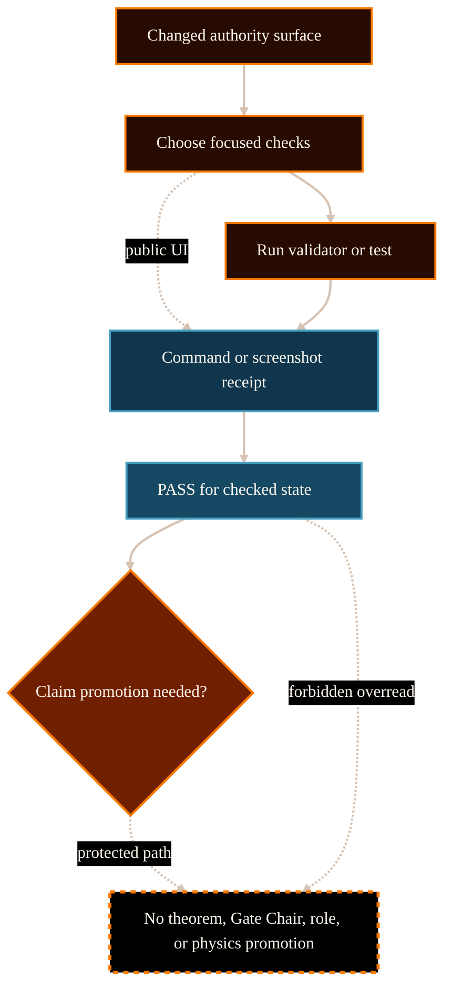

# Validator PASS Does Not Mean Physics Proof System Analysis

## Purpose

This analysis supports PG-019: rewriting
`/project/operations/validator-operator-workflow/` so validator PASS limits are
explicit and understandable.

The reader should understand that validators are necessary operational
evidence for a checked state, but they are not theorem proof, physics claim
promotion, Gate Chair approval, role authority, or publication quality by
themselves.

## Scope And Authority

This document is website-maintained explanatory analysis. It is not source
authority, does not define validator behavior, does not change command
semantics, does not change checkpoint gates, does not authorize sidecar
adoption, and does not promote scientific claims.

The authoritative source for validator meaning remains committed upstream
project-control material, especially the validator/operator workflow explainer,
research-control guide, mathematical-decisiveness contract, claim-gates
explainer, validator scripts, and task-local completion records.

## Evidence Reviewed

Committed upstream sources were inspected via `git show HEAD:<path>` to avoid
using dirty working-tree material.

- `/Volumes/P-SSD/AngryOwl/The-AEther-Flow/github-facing/validator-operator-workflow-explainer.md`
  - Defines command selection by changed surface and PASS-result limits.
- `/Volumes/P-SSD/AngryOwl/The-AEther-Flow/github-facing/claim-gates-explainer.md`
  - Defines why validator pass state must not become claim promotion or Gate
    Chair approval.
- `/Volumes/P-SSD/AngryOwl/The-AEther-Flow/research_control/README.md`
  - Defines validators as boundary enforcement and states that PASS is
    operational receipt evidence only for key physics routes.
- `/Volumes/P-SSD/AngryOwl/The-AEther-Flow/research_control/design/mathematical_decisiveness_completion_contract.md`
  - Defines explicit physics-progress fields and forbids reading
    `validation_status: "PASS"` as theorem proof or downstream GR promotion.
- `/Volumes/P-SSD/AngryOwl/The-AEther-Flow/scripts/research_control/README.md`
  - Provides research-control validator and checkpoint context.
- `/Volumes/P-SSD/AngryOwl/The-AEther-Flow/scripts/project_control/README.md`
  - Provides project-control validator and documentation-impact context.
- `/Volumes/P-SSD/AngryOwl/The-AEther-Flow/tests/README.md`
  - Provides focused test context for tooling changes.
- `/Volumes/P-SSD/AngryOwl/The-AEther-Flow-Website/src/pages/project/operations/validator-operator-workflow/index.astro`
  - Existing website route to rewrite in place.
- `/Volumes/P-SSD/AngryOwl/The-AEther-Flow-Website/docs/content-dossiers/operations-validator-operator-workflow/dossier.md`
  - Existing public-comprehension dossier and diagram contract.

## Source-State Note

The upstream working tree is currently dirty because later candidate-era files
exist outside the committed source state. PG-019 therefore uses committed HEAD
records only and does not rely on uncommitted validator or completion records.

## System Context

Validators sit inside the governed operations stack. AgentJobs name required
validators, allowed paths, outputs, and claim boundaries; completion records
then preserve command evidence. That means a PASS result is meaningful only for
the named check and checked state (The AEther Flow, 2026a, 2026c).

Physics and mathematics require separate source evidence. The
mathematical-decisiveness contract makes this explicit: `validation_status:
"PASS"` proves that the task followed project-control rules, not that a theorem
was established, a source-side law was adopted, `M_src` was constructed,
`g_eff` was defined, coupling or Einstein equations were derived, the benchmark
was promoted, or a Gate Chair decision closed (The AEther Flow, 2026d).

## Functionality Or Topic Analysis

### What PASS can mean

PASS can mean that a deterministic command accepted the current repository
state under its configured checks. It can support a completion receipt, a
checkpoint receipt, a publication QA record, a documentation-impact record, or
focused tooling evidence. This is valuable because it makes work reproducible
and reviewable.

### What PASS cannot mean

PASS cannot establish scientific truth beyond the checked command. It cannot:

- prove a theorem;
- adopt ontology;
- construct `M_src`;
- define `g_eff`;
- derive matter coupling or Einstein equations;
- promote a benchmark;
- issue or replace Gate Chair approval;
- expand role authority;
- approve editorial quality without human review;
- globally allowlist a sidecar directory; or
- turn generated output into source authority.

### Operator decision model

The safe operator sequence is:

1. Identify the changed authority surface.
2. Choose focused validators, tests, screenshots, and documentation-impact
   receipts for that surface.
3. Record command evidence and rendered UI evidence when relevant.
4. Read PASS only as acceptance for the checked state.
5. Route scientific promotion, ontology adoption, benchmark promotion, and Gate
   Chair closure through their own source and human-gated authority paths.

## Mermaid Diagram

Visual grammar: orange process nodes are operator decisions and checks; blue
nodes are evidence records; the green node is a scoped PASS result; the dashed
orange boundary marks forbidden overread. Solid arrows show the valid evidence
chain. Dashed arrows show supporting evidence and forbidden promotion.

## Interfaces, Inputs, And Outputs

| Interface | Input | Output | Boundary |
| --- | --- | --- | --- |
| Validator command | Repository state and check configuration | PASS or failure for that check | Not scientific proof. |
| Focused tests | Tooling or script behavior | Evidence for implementation behavior | Not source authority. |
| Screenshot QA | Rendered public UI | Visual evidence | Not claim proof or editorial approval alone. |
| Documentation-impact receipt | Changed source/generated surfaces | Coverage of documentation impact | Not physics promotion. |
| Research-control validator | Tasks, jobs, completions, handoffs, registries | Control-state acceptance | Not theorem proof. |
| Human gate | Explicit protected decision | Promotion or closure if authorized | Cannot be replaced by PASS. |

## Risks, Failure Modes, And Claim Boundaries

Implementation and workflow risks:

- running a generic command set instead of checks for the changed authority
  surface;
- omitting screenshot evidence when public UI changed;
- treating source-bridged sidecar path acceptance as global sidecar adoption;
- treating test success as full behavioral proof outside tested cases.

Source-authority risks:

- treating generated-output validation as source authority;
- treating publication checks as scientific review;
- treating a validator report as a substitute for source inspection.

Scientific and mathematical claim risks:

- PASS does not prove a theorem;
- PASS does not adopt ontology, `M_src`, `g_eff`, matter coupling, Einstein
  equations, or benchmark status;
- PASS does not issue a Gate Chair verdict;
- PASS does not establish global theory rejection or future
  source-extension impossibility.

## Open Questions

No blocking open questions were identified from the reviewed committed
evidence. The public page should avoid listing private or environment-specific
command output unless it is part of a checked-in QA record.

## Logical Next Step

Rewrite `/project/operations/validator-operator-workflow/`, update its dossier
and diagram, refresh manifests/provenance, then run desktop/mobile browser QA.

## References

The AEther Flow. (2026a). *Validator and operator workflow*
[`github-facing/validator-operator-workflow-explainer.md`].

The AEther Flow. (2026b). *Claim gates, negative results, and freeze criteria*
[`github-facing/claim-gates-explainer.md`].

The AEther Flow. (2026c). *Research control*
[`research_control/README.md`].

The AEther Flow. (2026d). *Mathematical decisiveness completion contract*
[`research_control/design/mathematical_decisiveness_completion_contract.md`].

The AEther Flow Website. (2026). *Validator and operator workflow route*
[`src/pages/project/operations/validator-operator-workflow/index.astro`].
